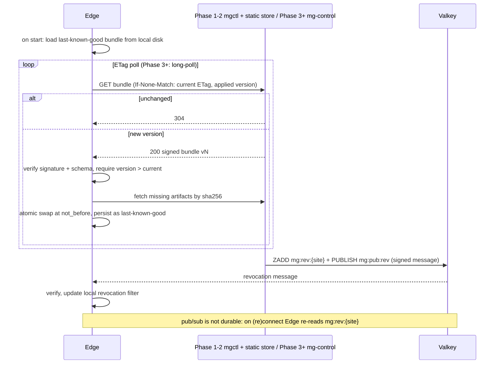

# 02 数据流

**结论**：个人自用版的数据流只依赖三类进程：Edge（Rust / Pingora，每台 Edge 主机一个）、Valkey、Go 控制面（`mgctl` / `mg-control`，含近线 worker），外加 VictoriaLogs（`vl-main`、`vl-short` 两个实例）与 VictoriaMetrics 两种单二进制存储。不用 Kafka / Redpanda、流处理框架或 Kubernetes（取舍见 [01](01-architecture.md) 与 [ADR-0007](adr/0007-lean-deployment.md)）。本文是**数据模型、Valkey 命名与源站契约**的唯一来源；上游认证与 Cloudflare 配置见 [08](08-upstream-and-cloudflare.md)，凭证与通用 Challenge 见 [04](04-challenge-and-tokens.md)，交互式 Challenge 见 [09](09-interactive-challenge.md)。

## 1. 三条链路

| 链路 | 时效 | 输入 | 输出 | 载体 | 约束 |
|---|---|---|---|---|---|
| **内联快路径** | 每请求，附加延迟 p99 < 5 ms | 请求上下文 + 本地缓存 + Valkey | Decision（放行 / 挑战 / 限速 / 阻断） | Edge + Decision Core（纯函数库） | 不同步调用近线 / 离线组件与控制面；每请求最多 1–2 次 Valkey 往返（合并为一个 pipeline）；Edge 与 Valkey 须同区域 / 同 VPC（RTT < 1 ms），否则该 Edge 以本地模式运行 |
| **近线**（Phase 2） | 秒级（事件到 verdict p95 < 10 s） | Edge 写入 Valkey 的窗口计数与有序集合；Valkey Stream `mg:ev` | 实体 verdict 写回 Valkey | Valkey + Go worker | 尽力而为：Stream 有长度上限，Valkey 故障切换可能丢事件；verdict 必带 TTL |
| **离线** | 分钟到天 | VictoriaLogs 明细；Phase 4 起单节点 ClickHouse | 报表、调查、规则调参、情报快照；Phase 4 起模型 | VictoriaLogs → ClickHouse（按需） | 产出物经签名后随配置包下发 |

```
Visitor --> Cloudflare (Free/Pro) --> cloudflared --> Edge 127.0.0.1 --> Origin
                                      \___________ Edge host ___________/
                                        (x N; Edge may share the origin host)
                                                     |
                                                     | same region / VPC, RTT < 1 ms
                                                     v
+--------------------------- brain VM (4-8 GB) ----------------------------+
| Valkey (AOF everysec)      mg-control + near-line worker (Go)            |
| PostgreSQL or SQLite       VictoriaLogs x2   VictoriaMetrics  [Grafana]  |
+--------------------------------------------------------------------------+
```

- 大脑 VM 故障只降级：Edge 用 last-known-good 配置、本地计数与本地缓存继续服务（降级表见 [01 §8](01-architecture.md#8-部署与高可用)）。
- 数据与状态只按 `site_id` 隔离，没有租户层。

## 2. 内联请求路径

```
Visitor
  |  cloudflare : Cloudflare edge -> cloudflared (same host) -> 127.0.0.1 listener
  |               or Cloudflare edge -> TLS listener that requires the AOP client cert
  |  direct_tls : TLS listener on a public address
  v
[0 Ingress]  UpstreamProfile of the listener (section 2.1; rules in 08)
  upstream.auth_method: loopback | origin_mtls | secret_header | src_cidr | none
    authenticated -> client_ip from the profile header (cloudflare: CF-Connecting-IP)
                     keep only header names the profile declares, strip the rest
    otherwise     -> strip all known upstream header families, client_ip = TCP peer
  always: strip client-sent MG-*; never XFF[0], True-Client-IP, X-Real-IP
  Host (+ SNI) -> Site; reject if the Site does not accept this listener
  |
[1 Protocol signals]
  direct_tls : ClientHello -> tls.ja4 {value, source=self, authenticated}, SNI, ALPN
               HTTP/1 raw header order + case -> http.header_order
  cloudflare : x-mg-cf-tls-*  -> edge_tls.* (family EDGE_TLS, shadow)
               x-mg-cf-*      -> rtt, asn, http version, crawler.cf_vbot, header-name set
               JA4 / h2 / header order + case / TCP /
               Accept-Encoding / Connection            -> MISSING
  |
  v
[Route match] -> Environment, Route(channel, sensitivity), PolicySet version
  |
  |-- /__mg/* ? --> SDK / Challenge / Renew / Refresh / Telemetry (section 3)
  v
[Identity]           (independent checks, run together)
  a. agent signature   Web Bot Auth (HTTP Message Signatures) -> agent_id, grant
  b. crawler claim     UA claims crawler -> official IP ranges / rDNS cache
                       (identity.crawler.cf_vbot is corroboration only)
  c. clearance token   decrypt, expiry, bindings: uah hard + ipp soft (Phase 1),
                       + cnf.jkt hard (Phase 2), ctp shadow (cloudflare only),
                       tfp (direct_tls only, after the JA4 spike)
  d. request proof     signature, iat window, jti SET NX (routes that require it)
  e. mTLS agent        direct_tls listeners only; API keys: on demand, unscheduled
  v
[Enrichment]
  mmdb: ASN / geo (GeoLite2)                (in-memory; upstream ASN / geo
                                              headers only cross-check)
  lists: Tor, cloud ranges, reputation      (in-memory radix / bloom)
  verdicts: ip, prefix, session, device,    (one pipelined MGET to Valkey,
            fp-cluster, account              local LRU in front)
  v
[Rate limiting]  local token bucket -> global GCRA (Valkey script, same pipeline)
  v
[Decision Core]  detectors -> Signals {state, source} -> RiskAssessment
                 (+ shadow families) -> Policy IR -> Decision
  v
[Enforce]        global monitor switch / rule dry_run: record, then ALLOW
  ALLOW/TAG  -> forward to origin with MG-* headers (section 8)
  CHALLENGE  -> 403 challenge page (HTML) or challenge JSON, no-store
  RATE_LIMIT -> 429 + Retry-After, no-store
  TARPIT     -> direct_tls only, optional (cloudflare: 125 s origin read timeout,
                shared origin connections -> never a default; 03 section 5)
  BLOCK      -> 403 generic page (request_id only)
  v
[Emit] DecisionEvent -> bounded ring buffer (+ optional disk spool) -> EventSink
         batch JSON lines (sampled)        -> VictoriaLogs vl-main
         counters + XADD mg:ev (summary)   -> Valkey (near-line, section 4)
```

### 2.1 第 0 步：上游认证与客户端 IP

**结论**：只有上游认证通过，才采信上游添加的头；认证不通过的请求按"直连"处理，协议层信号只能来自 Edge 自己。认证方式、删除清单与各 profile 的头映射以 [08 §1.2](08-upstream-and-cloudflare.md#12-信任规则) 为准，本节只列数据流上的结果。Phase 1 只实现 `cloudflare` 与 `direct_tls`。

| profile | `upstream.auth_method` | 客户端 IP（`net.ip_source`） | 采信的上游头 | 协议层信号 |
|---|---|---|---|---|
| `cloudflare`（Tunnel，推荐） | `loopback`，可叠加 `secret_header`（`x-mg-upstream-key`） | `cf_connecting_ip`；Pseudo IPv4 = Overwrite 时 `cf_connecting_ipv6`（Tunnel 下该头到达需实测） | `CF-Connecting-IP`、`Cf-Ray`、`CF-Visitor`、`CF-Worker`（校验用）、已确认开启的 visitor location 头、`x-mg-cf-*`（§2.2）、启用时的 `x-mg-upstream-key` | JA4、HTTP/2 指纹、头顺序与大小写、TCP 特征、`Accept-Encoding`、`Connection` 为 `MISSING` |
| `cloudflare`（AOP） | `origin_mtls`（所有者自有 CA，zone-level 或 per-hostname） | 同上 | 同上 | 同上 |
| `direct_tls` | `none` | `tcp_peer` | 无：全部上游头族删除 | `tls.ja4`（`source=self`）、SNI、ALPN；HTTP/1 原始头顺序与大小写 |
| `proxy_protocol`（Phase 5） | `src_cidr` | `proxy_v1` / `proxy_v2` | 同 `direct_tls` | 同 `direct_tls` |

- 站点声明接受哪些监听器；从未授权监听器进入的请求直接拒绝，防止绕过前置 CDN。CDN 专用监听器上认证失败不回退为"直连"：mTLS 握手失败即断开，密钥头不符返回 403，计入 `mg_upstream_auth_failures_total` 并告警。
- 未认证请求携带的上游头族全部删除，计入 `mg_upstream_headers_stripped_total`。认证通过时也只保留上表声明的头名：Cloudflare 把客户端头原样转给源站。
- 认证通过但缺少 `CF-Connecting-IP`：`upstream.client_ip_header_missing = true`，计入 `mg_cf_connecting_ip_missing_total` 并告警，**不回退**到 Cloudflare 对端 IP；NETWORK 族为 `MISSING`，按 IP 的限速改用会话 / 路由维度，路由按其 fail-open / fail-closed 配置执行。
- 永远不用 `X-Forwarded-For` 最左项、`True-Client-IP`、`X-Real-IP`；`CF-Worker` 来自非所有者 zone 时丢弃并告警（[08 §2.2](08-upstream-and-cloudflare.md#22-客户端-ip)）。

### 2.2 `x-mg-cf-*` 解析（`cloudflare` profile）

**结论**：`x-mg-cf-*` 由所有者 zone 上的一条 Tier 0 Request Header Transform Rule 用 Set 写入（覆盖客户端同名头，值为空时删除）。同一条规则还删除 Tier 1 头名，所以 Tier 1 Snippet / Worker 未运行时，客户端伪造的值不会留存（[08](08-upstream-and-cloudflare.md) §2.3）。Edge 只解析 profile 声明的头名，结果只进 RequestContext，不转发源站。信号定义与权重见 [03](03-risk-scoring.md)。

| 头 | RequestContext 字段（与 CEL 同名） | 族 | 限制 |
|---|---|---|---|
| `x-mg-cf-tls-version`、`-tls-cipher`、`-tls-ciphers-sha1`、`-tls-hello-len` | `edge_tls.version`、`cipher`、`ciphers_sha1`、`hello_len` | EDGE_TLS | shadow；`hello_len` 分桶后使用；`ciphers_sha1` 的源字段拼写需实测 |
| `x-mg-cf-tls-ext-sha1` | `edge_tls.ext_sha1` | EDGE_TLS | 只记录；实测稳定前不得用于绑定或高权重 |
| `x-mg-cf-tls-random` | 不进 RequestContext；内存中取 `client_conn_key = hash(value)` | RATE | 见 §2.3 |
| `x-mg-cf-http-version` | `http.version`（`version_source = cloudflare`） | HTTP | 访客到 Cloudflare 的协议版本 |
| `x-mg-cf-rtt`、`x-mg-cf-quic-rtt` | `net.rtt_ms` | NETWORK | 弱信号，shadow |
| `x-mg-cf-asn` | `net.upstream_asn` | NETWORK | 只交叉校验，以本地 GeoLite2 为准 |
| `x-mg-cf-vbot`、`x-mg-cf-vbot-cat` | `identity.crawler.cf_vbot`、`cf_vbot_cat` | EXTERNAL | 只作佐证，以 MorphGate 自有验证为准（[05](05-ai-agent-policy.md)） |
| `x-mg-cf-hdr-names` | `http.header_names` | HTTP | 顺序不保证，只当集合用 |
| `cf-ipcountry`、`cf-region`、`cf-timezone` | `net.upstream_country` / `upstream_region` / `upstream_timezone` | NETWORK | `mgctl cf audit` 确认 Managed Transform 已开启才采信；城市、经纬度、邮编丢弃；`CN` 不选 Turnstile |
| Tier 1：`x-mg-cf-priority`、`x-mg-cf-accept-encoding`、`x-mg-cf-as-org`；标记头 `x-mg-cf-t1` | `http.priority`、`http.accept_encoding_orig`、`net.as_org` | HTTP / NETWORK | 可选，shadow；缺少 `x-mg-cf-t1`（未运行、fail-open）或来源不可确认时为 `MISSING`，不告警（[08](08-upstream-and-cloudflare.md) §2.4；Worker 与 Transform Rule 的先后顺序需实测） |

profile 预期提供而实际缺失的上游注入头（如认证通过的请求缺少 `x-mg-cf-tls-version`）为 `MISSING`，计入 `mg_upstream_signal_missing_total` 并告警，不算到访客头上。有条件的字段不算缺失：明文 HTTP 没有 TLS 字段，TCP 客户端没有 QUIC RTT。

### 2.3 要点

- 身份检查先于评分。可验证身份会改变后续的分类和策略分支（[03](03-risk-scoring.md)、[05](05-ai-agent-policy.md)），但**不会跳过**限速和授权范围检查。
- rDNS 反查不在请求路径上同步执行：首次遇到的"声称爬虫"请求按未验证处理并异步反查，结果按 IP 缓存。
- Valkey 访问合并为一个 pipeline：verdict MGET + 限速脚本 + jti / nonce `SET NX`。
- **不以下游连接作为任何状态的键**：`cloudflare` 下回源连接（cloudflared 到 Edge，或 HTTP/2 to Origin 的多路复用连接）被多个访客共享。"每连接"特征统一用 `client_conn_key`：`direct_tls` 取 Edge 自己的下游连接，`cloudflare` 取 `hash(x-mg-cf-tls-random)`，没有值时为 `MISSING`。`client_conn_key` 只在 Edge 内存与近线窗口计数（`mg:w:*`）中使用，不进 RequestContext、`mg:ev` 与 VictoriaLogs。
- **信号状态**只有 `PRESENT` / `ABSENT` / `MISSING`，语义以 [03 §3.1](03-risk-scoring.md#31-信号状态与上游可用性) 为准：`ABSENT` 是当前 profile 应能提供、本请求没有（如尚无 SDK 遥测或凭证），计入置信度分母；`MISSING` 是 profile 不提供（不在 `expected_mask` 中），或上游应注入的头未到达 / 来源不可确认，不计入。两者都不是人类证据。
- 数据面唯一的出站调用：交互式 Challenge 选用外部 Provider（如 Turnstile siteverify）时，在 `POST /__mg/c` 内、消费 nonce 之后带截止时间调用。普通请求路径没有外部调用。
- 日志写出永不阻塞请求；缓冲满时按优先级丢弃（先丢放行流量的采样事件），丢弃数计入 `mg_event_dropped_total`。

## 3. Challenge、SDK 遥测与凭证刷新

**结论**：`/__mg/*` 全部由 Edge 以第一方、同源方式提供，不依赖第三方域名（大陆访客可用）。请求体一律不解压：带 `Content-Encoding` 的请求直接拒绝，超过下表上限的请求直接拒绝（`/__mg/c` 的拒绝形式按统一失败，见 [04 §9](04-challenge-and-tokens.md#9-协议约定)）。Cloudflare 侧的缓存 Bypass、Skip 与限速规则见 [08](08-upstream-and-cloudflare.md) §2.6–2.7。

路径前缀默认 `/__mg/`，可按站点改为随机前缀；改前缀后 Cloudflare 侧规则须同步，由 `mgctl cf audit` 检查。

| 端点 | 作用 | 请求体上限 | 缓存头 | 说明 |
|---|---|---|---|---|
| `GET /__mg/s/{build}.js` | Web SDK 与 Challenge 组件（含 PoW Worker），文件名为内容哈希 | — | `public, max-age=31536000, immutable`，允许边缘缓存 | 核心包 ≤ 30 KB gzip；多态构建见 [04](04-challenge-and-tokens.md#8-morph-动态变形)（Phase 5） |
| `POST /__mg/c` | 提交 Challenge 解答，成功则签发凭证 | 8 KB | `no-store, private` | 响应（导航 303 → `ret`、fetch 200 `{"ok":true}`、`mg_challenge_failed`、429）以 [04 §9](04-challenge-and-tokens.md#9-协议约定) 为准；验证顺序见 04 §4.1，提交格式见 [09](09-interactive-challenge.md) §4.4 |
| `POST /__mg/c/renew` | 交互式 C 在寿命约 80% 时静默续期，返回新 C | 8 KB | `no-store, private` | 旧 nonce 以 `SET NX` 消费，不计失败；规则见 [04 §3.1](04-challenge-and-tokens.md#31-状态机) |
| `POST /__mg/r` | 凭证静默刷新：持有证明 + 最新遥测，重新评分后签发 | 16 KB | `no-store, private` | 风险升高则拒绝刷新并要求 Challenge |
| `POST /__mg/t` | 批量遥测上报（会话密钥签名） | 16 KB | `no-store, private` | 按会话限频 |
| `POST /__mg/m/attest/*` | 移动端设备证明 | 届时定 | `no-store, private` | 按需、后期（Phase 5） |

**通用规则**

- Edge 在受保护路径上生成的 Challenge 响应（403 页面 / JSON）同样 `no-store, private`，HTML 另加 `X-Robots-Tag: noindex`；状态码用 403 / 429，不用 200（Free / Pro / Business 下 Origin Cache Control 始终开启，`max-age=0` / `no-cache` 仍会被缓存）。
- 0-RTT 首选保持关闭；若开启，`/__mg/c`、`/__mg/c/renew`、`/__mg/r`、`/__mg/m/*` 对 `Early-Data: 1` 返回 425（Cloudflare 是否把 425 透传给浏览器需实测；[04](04-challenge-and-tokens.md) §4.3）。
- SDK 对 `/__mg/*` 或受保护 fetch 收到 `cf-mitigated: challenge` 时视为"上游挑战"：顶层重载 + 遥测上报，不计为 MorphGate 失败，计入 `mg_double_challenge_total`（[08](08-upstream-and-cloudflare.md) §2.8）。
- Free 区唯一的一条 Cloudflare 限速规则可在边缘挡 `POST /__mg/` 洪泛；使用它时 `/__mg/` 的 Skip 规则不得跳过 `http_ratelimit`（[08](08-upstream-and-cloudflare.md) §2.7）。精确限额由 Edge 负责。

**遥测流**：SDK 在端上把原始事件摘要成统计特征 → `POST /__mg/t` → Edge 校验签名、大小、频率 → 附加服务端上下文（客户端 IP、`upstream.profile`、`tls.ja4` 或 `edge_tls` 摘要、会话）→ `XADD mg:ev`（`kind=telemetry`）并写 `vl-short` → 近线会话聚合。交互式 Challenge 遥测（≤ 2 KB）随 `POST /__mg/c` 提交，同样以 `kind=telemetry` 写 `vl-short`（字段见 [09](09-interactive-challenge.md) §10）。

**Challenge 结果流**：`POST /__mg/c` 在任何外部 Provider 调用之前以 `SET mg:n:{site}:{nonce} NX` 消费 nonce；外部 Provider token 的哈希写入 `mg:rp:*`。结果以 `ChallengeResult`（§7）写入 `mg:ev`（`kind=feedback`）与 `vl-main`，只带内部 reason code，并更新 `mg_challenge_total{provider}`、`mg_provider_verify_total`。

## 4. 近线：会话与实体分析

**结论**：近线跑在 Valkey 上：Edge 直接维护实体级窗口计数，并把每请求摘要写入一个带长度上限的 Stream；一个 Go worker 消费 Stream、读取窗口、计算 verdict 并写回 Valkey。事件是尽力而为的遥测，丢少量不影响正确性；离线分析以 VictoriaLogs 为准。

```
Edge (background task, batched every <= 1 s, never on the request path)
  |
  +-- INCR / PFADD / ZINCRBY  mg:w:*  (entity windows, heavy hitters) --+
  |                                                                     |
  +-- XADD mg:ev MAXLEN ~ N  {kind, site, session, route, action, ...} -+
                                                                        |
                                                                        v
                                                     +------------------------+
                                                     | Valkey  (brain VM)     |
                                                     | AOF everysec           |
                                                     +-----------+------------+
                                                                 |
                     XREADGROUP (group nl) / XACK / XAUTOCLAIM;  |
                     read + update windows and session state     |
                                                                 v
+--------------------------------------------------------------------------+
| near-line worker (Go, single consumer, shards by session key in-process) |
|  session aggregator : request timing, path transitions, asset ratio,     |
|                       enumeration, page loaded but SDK never ran         |
|  entity aggregator  : ip / prefix / asn / device / account / fp-cluster  |
|                       counts, HLL, failure and challenge-failure rates   |
|  scanner detector   : 404 ratio, sensitive paths, payload markers        |
|  challenge monitor  : solve-time distribution, clearance issuance per    |
|                       prefix / ASN, double-challenge counts              |
+------------------------------------+-------------------------------------+
                                     |
                                     v
             EntityVerdict {risk, labels, reasons, source, version, ttl}
                  |                        |                        |
       SET mg:v:* EX ttl          PUBLISH mg:pub:inv       kind=verdict JSON line
       (Edge MGET, local LRU)     (Edge drops LRU entry)   -> VictoriaLogs vl-main
```

| 设计点 | 方案 |
|---|---|
| 写入 | Edge 后台任务每 ≤ 1 s 用一个 pipeline 批量写入；Stream 条目是紧凑摘要（每请求一条，不采样），完整事件走 VictoriaLogs |
| 长度上限 | `XADD mg:ev MAXLEN ~ N`；N 按"可容忍的 worker 停机时长 × 峰值 rps"取，例如 500 rps × 10 分钟 ≈ 30 万条。单条大小与内存占用需实测 |
| 消费 | 单个 worker 作为消费组 `nl` 的唯一消费者，进程内按会话键哈希分片到 goroutine，保证单会话有序；处理后 `XACK`，重启后用 `XPENDING` / `XAUTOCLAIM` 接回未确认条目。语义为至少一次，聚合容忍少量重复 |
| 状态 | 实体窗口（计数、HLL、heavy hitter 有序集合）与会话状态都存 Valkey 并带 TTL；worker 无本地持久状态，可随时重启 |
| verdict | `SET mg:v:{site}:{type}:{key} EX ttl`；`PUBLISH mg:pub:inv` 让 Edge 立即淘汰本地 LRU；同时以 `kind=verdict` 写 `vl-main`。IP / ASN 类 verdict 可按站点开关在所有者各站点间共用（`{site}` 写 `all`，设计见 [01 §10](01-architecture.md#10-站点模型)） |
| 持久性 | Valkey AOF `everysec`：崩溃时可能丢最近约 1 s 的写入；官方文档指出故障切换后可能缺失 `XADD` 与消费组状态。DecisionEvent 为尽力而为的遥测，可以接受 |
| 降级 | worker 停止：Stream 截断最旧条目，已有 verdict 按 TTL 过期，Edge 继续按规则评分。Valkey 不可用：Edge 本地模式（[01](01-architecture.md)） |
| 扩展 | 需要多个消费者时按会话哈希拆成 `mg:ev:{shard}`；需要可回放的独立总线时，通过 `EventSink` trait 换成单节点 NATS JetStream（R1），Decision Core 不变 |
| 监控 | 流长度、`XPENDING` 待确认数、事件到 verdict 延迟由 VictoriaMetrics 采集（指标与告警见 [06](06-policy-console-observability.md) §5） |

- 检测器全部以 shadow 模式上线，verdict 带 `source` 与 `version`，可按来源整体关闭。
- 扫描器识别（高 404 比例、敏感路径探测、载荷特征）在这里完成，产出 `scanner` 标签。
- 交互式 Challenge 的收割防护监控（解题时间分布、按前缀 / ASN 的凭证签发数）在这里汇总，签发上限本身由 Edge 内联执行（[09](09-interactive-challenge.md)）。
- 会话级序列特征只统计回源请求：Cloudflare 缓存命中的静态资源不会到达 Edge（[03](03-risk-scoring.md)）。
- 设备 × 账号 × IP 的图关联推迟到 Phase 4。

## 5. 离线

**结论**：Phase 4 之前，"离线"就是 VictoriaLogs 查询加 VictoriaMetrics 指标；开始做 ML / 复杂 SQL，或大脑 VM 达到 8 GB 以上时，再加单节点 ClickHouse LTS。

| 环节 | Phase 1–3 | Phase 4 起（按需） |
|---|---|---|
| 入库 | EventSink 批量写 VictoriaLogs：每事件一行 JSON，允许 ip、session、request_id 等高基数字段；入库延迟目标 < 60 s | EventSink 增加 ClickHouse sink：批量写入，或 `async_insert=1` + `wait_for_async_insert=1`，从不逐请求 INSERT；低内存配置；VictoriaLogs 继续保存日志类数据 |
| 聚合 | Edge 指标（pingora-prometheus）进 VictoriaMetrics，作为看板主数据；临时统计用 LogsQL 的 stats 管道 | ClickHouse 物化视图生成分钟级聚合（站点 × 动作 × 分类 × 路由） |
| 调查 | Console 按 request_id / `cf_ray` / 会话 / IP / Agent 检索明细与时间线（查询 VictoriaLogs，也可直接用其内置 UI） | 数据源切换为 ClickHouse |
| 训练 | 用查询结果人工调整规则权重与阈值 | 弱监督标签 → 特征快照 → GBDT 训练 → 概率校准 → 离线评估 → shadow 对比 → 签名注册 → 灰度下发 |
| 情报同步 | 控制面定时任务（Phase 1–2 由 `mgctl` 运行，Phase 3 迁入 `mg-control`）拉取 GeoLite2 IP / ASN、云厂商网段、Tor 出口、爬虫官方 IP 段、Agent 密钥目录，以及 Cloudflare IP 段（`GET https://api.cloudflare.com/client/v4/ips`，带 etag）→ 校验格式与体积变化 → 版本化快照 → 随配置包下发；Cloudflare IP 段同时同步到云安全组 | 同左 |
| 备份 | 每晚把 Valkey RDB、pg_dump / SQLite 文件、VictoriaMetrics / VictoriaLogs 快照写入对象存储 | 加 ClickHouse 备份 |

不用 ClickHouse Cloud：没有香港 / 中国区域，且增加跨区流量。

## 6. 配置、模型与密钥下发

**结论**：只有 Edge 拉取，控制面从不推送（不用 gRPC 流）。Phase 1–2 由 `mgctl` 把签名配置包上传到大脑 VM 上的静态位置，Edge 以 ETag 条件请求经 mTLS 或 WireGuard 内网拉取；Phase 3 起改为向 mg-control 长轮询（本节为规范口径）。吊销等需要秒级生效的收紧操作经 Valkey pub/sub 通知（Edge 本来就连 Valkey）。控制面不可用时，Edge 使用本地保存的 last-known-good。

```
mgctl / Console        owner only; sensitive ops need re-auth + typed site name
  |                    + optional delay
  v
PostgreSQL or SQLite   source of truth; every change appended to the audit hash chain
  |                    (Phase 1-2: policy files + mgctl local append-only audit log)
  v
Policy Compiler (Go, cel-go v0.30)
  parse + type-check CEL -> restricted IR, cost estimate,
  check every referenced signal against the site's UpstreamProfile
  |
  v
Site Bundle vN
  routes, upstream profile + expected signal set, policy IR, rate limits,
  challenge + provider config, agent grants + public keys, crawler registry,
  global monitor switch, not_before, key ids only (never key material),
  artifact refs by sha256: mmdb, lists, Cloudflare IP snapshot, models
  signed with the owner's Ed25519 key (kid); ETag = content hash
    Phase 1-2: signed by mgctl on the owner workstation
    Phase 3+ : signed by mg-control on the brain VM
  |
  v   Edge pulls; the control plane never pushes
Phase 1-2: mgctl uploads bundle + artifacts to a static location on the brain VM
Phase 3+ : bundle endpoint on mg-control (ETag long-poll)
           both reachable only over mTLS / WireGuard
```



| 项目 | 设计 |
|---|---|
| 拉取 | Phase 3 起长轮询：控制面有新版本时立即返回，否则保持到超时（默认 60 s，可配置）后返回 304。Phase 1–2 对静态位置做周期性条件请求，间隔满足"配置下发生效 < 30 s"（[06](06-policy-console-observability.md) §5）。两阶段都在收到 `mg:pub:cfg` 提示后立即拉取 |
| 校验 | 签名、schema、版本单调递增；拒绝低于当前版本的包。回滚 = 以旧内容发布一个新版本号 |
| 生效 | 原子切换；`not_before` 支持敏感操作的可选生效延迟；生效版本在下一次拉取时上报，并以 `mg_config_version`、`mg_config_age_seconds` 暴露 |
| 大文件 | mmdb、名单、Cloudflare IP 快照、模型放在同一拉取位置或对象存储，配置包只含 `sha256` 引用 |
| 密钥 | 密钥材料不进配置包，只引用 `kid`。按站点的凭证密钥、Challenge 密封根密钥 `K_seal_root`、Turnstile secret 以本机加密文件交付到 Edge 主机（systemd credentials），控制面不可用时 Edge 仍能重启；配置签名私钥为所有者一对。每日 epoch 密钥（`k_epoch`、`k_bind_epoch`）由各 Edge 从 `K_seal_root` 以 HKDF 确定性派生，无需每日分发（[ADR-0005](adr/0005-token-and-sealed-challenge-format.md)）。保管方式、清单与轮换周期以 [06 §8](06-policy-console-observability.md#8-平台自身安全) 为准 |
| pub/sub | 控制面（Phase 1–2 为 `mgctl`）只发两类消息：吊销（`mg:pub:rev`：凭证 `sub` / `jti`、Agent 授权、测试工单、`kid`，只会收紧）与新配置包提示（`mg:pub:cfg`）；近线 worker 发 `mg:pub:inv`。任何放宽（含全局 monitor 开关）只经签名配置包生效。吊销消息与配置包用同一签名密钥签名，Edge 校验后生效；Edge 的 Valkey 账号用 ACL 禁止写 `mg:rev:*` 与发布 `mg:pub:*`（ACL 规则需实测） |
| 吊销时效 | 目标 < 5 s；吊销集为有序集合（score = 过期时间），过期成员定期清理 |
| 灰度 | 配置包可指定目标 Edge 子集或流量百分比；每条规则可单独 `dry_run` |

控制面的外部调用（数据面不参与）：Cloudflare API（最小权限 Token）用于 `mgctl cf audit`、IP 段同步、Turnstile widget 管理与 secret 轮换、按需下推 AI bot 策略（[08](08-upstream-and-cloudflare.md) §2.10）；情报源见 §5。

## 7. 核心数据模型

跨进程的消息定义（事件、近线、调查工具）在 `proto/morphgate/v1/`；Decision Core 内部使用原生 Rust 类型。下面是设计口径：字段路径与 CEL 字段一致（[06 §2](06-policy-console-observability.md#2-策略语言)），信号族与取值与 [03](03-risk-scoring.md)、[04](04-challenge-and-tokens.md) 一致。字段为 `MISSING` / `ABSENT` 时的策略求值语义（"未知"、`missing_input`、`has(x)`）以 06 §2 为准。映射例外：`RiskAssessment.bot_class` / `top_reasons` 在 CEL 中暴露为 `risk.class` / `risk.reasons`（06 §2）。

```proto
message RequestContext {
  string request_id = 1;  int64 ts_ms = 2;
  string site_id = 3;  string env = 4;  string route_id = 5;
  Channel channel = 6;            // WEB | API | MOBILE
  UpstreamInfo upstream = 7;
  Net net = 8;
  Tls tls = 9;                    // visitor TLS: Edge itself or an authenticated upstream
  EdgeTls edge_tls = 10;          // cloudflare only, from x-mg-cf-tls-*
  Http http = 11;
  Identity identity = 12;
  string session_id = 13;         // pseudonymous (clearance sub)
  uint32 availability_mask = 14;  // bit per SignalFamily: present on this request
  uint32 expected_mask = 15;      // bit per SignalFamily: expected from this UpstreamProfile
  ClientSignals client = 16;      // SDK-derived, summarized (optional)
  repeated EntityVerdict verdicts = 17;
  // No client_random / client_conn_key field: the per-connection key lives in Edge
  // memory and near-line windows (mg:w:*) only, never in events.
}

message UpstreamInfo {
  UpstreamProfileKind profile = 1; // CLOUDFLARE | DIRECT_TLS | PROXY_PROTOCOL | CLOUDFRONT | GCP_ALB
                                   // | ESA | EDGEONE | ALICDN | TENCENT_CDN | ENVOY | OPENRESTY
  bool authenticated = 2;
  string cf_ray = 3;               // Cf-Ray, logged in every event for correlation with Cloudflare logs
  string auth_method = 4;          // loopback | origin_mtls | secret_header | src_cidr | none (08 §1.2)
  bool client_ip_header_missing = 5; // authenticated but no CF-Connecting-IP -> config alarm
}

message Net {
  string ip = 1;  string ip_prefix = 2;  // /24 (v4) or /48 (v6)
  string ip_source = 3;           // tcp_peer | cf_connecting_ip | cf_connecting_ipv6 | proxy_v1 | proxy_v2
                                  // | cloudfront_viewer_address | gcp_alb | esa | edgeone | alicdn
                                  // | tencent_cdn | gateway
  uint32 asn = 4;  string as_org = 5;  string country = 6;  string conn_type = 7;  bool tor = 8;
  uint32 upstream_asn = 9;        // x-mg-cf-asn, cross-check only
  string upstream_country = 10;  string upstream_region = 11;  string upstream_timezone = 12;
  uint32 rtt_ms = 13;             // x-mg-cf-rtt / x-mg-cf-quic-rtt
}

message Tls {                     // TLS family; MISSING under cloudflare
  bool available = 1;
  string version = 2;  string sni = 3;  string alpn = 4;
  Ja4 ja4 = 5;                    // CEL tls.ja4; source SELF | CLOUDFRONT | GCP_ALB | ESA | ENVOY | OPENRESTY
  message Ja4 { string value = 1;  SignalSource source = 2;  bool authenticated = 3; } // !authenticated -> not scored
}

message EdgeTls {                 // EDGE_TLS family (CEL edge_tls.*): low weight, low cap, shadow first
  string version = 1;  string cipher = 2;
  string ciphers_sha1 = 3;        // cipher list hash in received order
  string ext_sha1 = 4;            // ordering / GREASE undocumented: record only, never bind
  uint32 hello_len = 5;           // bucketed before use; also input of bind.ctp
}

message Http {                    // no HTTP/2 frame fingerprint field (deferred indefinitely)
  string version = 1;  SignalSource version_source = 2;
  string method = 3;  string host = 4;  string path = 5;  repeated string query_keys = 6;
  repeated string header_order = 7;  // direct_tls HTTP/1 only; empty otherwise
  repeated string header_names = 8;  // set semantics (x-mg-cf-hdr-names under cloudflare)
  string user_agent = 9;  repeated string cookie_names = 10;
  uint32 body_size = 11;  string content_type = 12;
  bool early_data = 13;           // Early-Data: 1 -> treat as replayable
  string priority = 14;           // Tier 1 x-mg-cf-priority (browser HTTP/2 priority), weak
  string accept_encoding_orig = 15; // Tier 1 x-mg-cf-accept-encoding (original value)
}

message Identity {                // CEL identity.*
  Token token = 1;                // {status, level (= lvl), age, per-item bind results}
  Proof proof = 2;                // {valid, replayed}
  Agent agent = 3;                // {id, grant_id, method}
  Crawler crawler = 4;            // {claimed, operator, purpose, verified, cf_vbot, cf_vbot_cat}
}

message Signal {
  string id = 1;           // e.g. "edge_tls.family_mismatch"
  SignalFamily family = 2; // NETWORK | TLS | EDGE_TLS | HTTP | CLIENT | BEHAVIOR
                           // | REPUTATION | RATE | IDENTITY | EXTERNAL
  float value = 3;         // [-1, 1]; > 0 automation evidence, < 0 human evidence
  float confidence = 4;    // [0, 1]
  string reason_code = 5;  // stable, internal only
  SignalState state = 6;   // PRESENT | ABSENT | MISSING (03 section 3.1)
  SignalSource source = 7; // self | cloudflare | cloudfront | gcp_alb | esa | envoy | openresty | sdk
  bool shadow = 8;         // family or detector in shadow: logged, not scored
}

message RiskAssessment {
  uint32 score = 1;        // 0..100, higher = more likely automated / abusive
  float confidence = 2;    // coverage over the profile's expected signals
  BotClass bot_class = 3;  // see 03 section 2
  repeated string labels = 4;  repeated string top_reasons = 5;
  string model_version = 6;  string ruleset_version = 7;
  uint32 shadow_score = 8; // score including shadow families, never enforced
}

message Decision {
  Action action = 1;       // ALLOW | LOG | TAG | RATE_LIMIT | CHALLENGE | TARPIT (direct_tls only) | BLOCK
  ChallengeType challenge_type = 2;
  string provider_id = 3;  // self_hold | pow_a11y | turnstile | tencent | aliyun_v2
  uint32 status = 4;  uint32 retry_after_s = 5;
  string rule_id = 6;  bool dry_run = 7;
}

message DecisionEvent {    // one JSON line in vl-main (kind = decision)
  RequestContext ctx = 1;  repeated Signal signals = 2;
  RiskAssessment risk = 3;  Decision decision = 4;
  uint32 latency_us = 5;  float sample_rate = 6;
  string edge_id = 7;  uint64 bundle_version = 8;  bool monitor_only = 9;
}

message ChallengeResult {  // kind = feedback, emitted by POST /__mg/c
  string request_id = 1;  string site_id = 2;  string route_id = 3;
  ChallengeType type = 4;  string provider_id = 5;
  string outcome = 6;      // pass | fail | unavailable | misconfigured
  string lvl = 7;          // invisible | pow | interactive | interactive_a11y
                           // | interactive_ext:{provider}   (attested: reserved, mobile later)
  uint32 attempt_no = 8;  uint32 solve_ms = 9;  string risk_band = 10;
  repeated string reason_codes = 11;  // internal only
  string cf_ray = 12;
}

message EntityVerdict {
  EntityType type = 1;     // IP | PREFIX | ASN | SESSION | DEVICE | ACCOUNT | FP_CLUSTER | AGENT
  string key = 2;          // hashed where it identifies a person
  uint32 risk = 3;  repeated string labels = 4;  repeated string reasons = 5;
  int64 expires_at_ms = 6;  string source = 7;  string version = 8;
  string site_id = 9;      // "all" = shared across the owner's sites (IP / ASN types only)
}
```

**Valkey 命名（规范，其他文档只引用本表）**

单实例 Valkey，不用 Cluster；除 Stream `mg:ev`（条目带 `site` 字段）与通知频道外，所有键都带 `{site}` 段。

| 用途 | 键 / 频道 | 类型 | 写入 → 读取 | TTL / 上限 |
|---|---|---|---|---|
| 近线输入 | `mg:ev` | Stream，条目字段 `kind` = decision / telemetry / feedback | Edge `XADD MAXLEN ~` → worker `XREADGROUP`（组 `nl`） | `MAXLEN ~ N`（§4） |
| 实体 verdict | `mg:v:{site}:{type}:{key}` | String（EntityVerdict） | worker → Edge `MGET` | verdict TTL |
| 窗口与会话状态 | `mg:w:{site}:...` | 计数 / HLL / 有序集合 / 哈希；含按 `client_conn_key` 的每连接计数 | Edge、worker → worker | 窗口长度或会话空闲超时 |
| 全局限速 | `mg:rl:{site}:{limiter}:{key}` | GCRA 状态（Lua） | Edge ↔ Edge | 由速率推导 |
| Challenge nonce | `mg:n:{site}:{nonce}` | `SET NX` | Edge（提交与续期） | ≥ C 剩余寿命 + 60 s |
| 持有证明 jti；Web Bot Auth nonce | `mg:jti:{site}:{jkt}:{jti}`；Web Bot Auth 取 `jkt` = 签名 `keyid`（JWK 指纹）、`jti` = H(`nonce`) | `SET NX` | Edge | 60 s；Web Bot Auth 为签名有效窗口（[05 §3.1](05-ai-agent-policy.md#31-web-bot-authhttp-message-signatures)） |
| 外部 Provider token 重放 | `mg:rp:{site}:{provider}:{H(token)}` | `SET NX` | Edge | token 寿命（Turnstile 300 s） |
| 吊销集 | `mg:rev:{site}` | 有序集合（score = 过期时间） | 控制面 → Edge | 成员到期清理 |
| 通知 | `mg:pub:rev`、`mg:pub:inv`、`mg:pub:cfg` | pub/sub 频道 | 控制面 / worker → Edge | 不持久 |

| VictoriaLogs `kind` | 来源 | 实例 |
|---|---|---|
| `decision` | Edge EventSink（采样后） | `vl-main` |
| `feedback` | Edge（ChallengeResult）；控制面（误报申诉、源站回传） | `vl-main` |
| `verdict` | 近线 worker | `vl-main` |
| `access` | Edge（每请求一条最小访问记录，假名化，不采样；供合规归档，§9） | `vl-main` |
| `telemetry` | Edge（`/__mg/t` 与 `/__mg/c` 附带遥测的校验后摘要） | `vl-short` |
| `audit` | 控制面审计记录的镜像，便于检索；主存储是控制面数据库中的哈希链（Phase 1–2 为 `mgctl` 本地日志，[06](06-policy-console-observability.md) §6） | `vl-main` |

## 8. Edge 与源站的约定

**结论**：本节是源站契约（`MG-*` 头、XFF 改写、Cookie 与响应规则）的唯一来源，[08](08-upstream-and-cloudflare.md) 只引用本节。

**入站**：一律删除客户端带来的 `MG-*` 头。上游头族的删除与保留按 §2.1，删除清单以 [08 §1.2](08-upstream-and-cloudflare.md#12-信任规则) 为准（含 `X-Forward-Port`、`Esa-*`、`Forwarded`）。每个请求记录 `upstream.cf_ray`（若有），Console 可按它与 Cloudflare 日志对照。

**出站（转发源站）**

| 头 | 值 / 处理 |
|---|---|
| `MG-Client-IP` | Edge 解析出的客户端 IP（规范头，源站应以它为准） |
| `MG-Request-Id`、`MG-Session` | 请求 ID；假名化会话 ID |
| `MG-Bot-Score`、`MG-Bot-Class`、`MG-Verified` | 分数、分类、已验证的 Agent / 爬虫 ID |
| `MG-Reasons` | reason code，默认关闭 |
| `X-Forwarded-For` | 改写为单值（= `MG-Client-IP`），源站按 `XFF[0]` 取 IP 也不会被伪造 |
| `X-Forwarded-Proto` | 认证通过时沿用上游的值，否则按 Edge 监听器自身的协议设置 |
| `CF-Connecting-IP`、`CF-IPCountry`、`Cf-Ray` 等 | 上游认证通过时原样转发，兼容依赖它们的源站应用 |
| 所有 `x-mg-*`（含 `x-mg-upstream-key`） | 删除，只供 Edge 使用 |

- 源站只接受来自 Edge 的流量：同机时源站只监听回环或 unix socket；不同机时用私网 ACL 或 Edge → 源站 mTLS，可选对 `MG-*` 头做 HMAC 签名，由源站中间件校验。

**响应方向**

- 删除源站响应中的内部头（`MG-*`）。
- 凭证 Cookie `__Host-mg_clr`（及 Pro 及以上可选的 `__Host-mg_cfp`，[08](08-upstream-and-cloudflare.md) §2.9）只在 `/__mg/c`、`/__mg/r` 的响应上设置，不附加到源站响应：Cloudflare 的"Eligible for cache + 覆盖 Edge TTL"组合会剥离 `Set-Cookie` 并缓存响应。
- Edge 生成的 Challenge / 阻断 / 限速响应：403 / 429（不用 200）+ `Cache-Control: no-store, private`；阻断页与失败页只带 `request_id`，不含检测细节。
- 需要注入 SDK 时用 lol_html 3.x 流式改写 HTML，先处理源站压缩；注入的标签带 CSP nonce 与 `data-cfasync="false"`（避免 Rocket Loader 改写）。只在选用 Turnstile 的页面追加其 CSP（[09](09-interactive-challenge.md)）。

## 9. 采样与保留

| 数据 | 采样 | 存储 | 保留 |
|---|---|---|---|
| DecisionEvent：非放行判定、敏感路由请求 | 100% | VictoriaLogs `vl-main` | 明细 30 天 |
| DecisionEvent：低敏感路由放行请求 | 按比例采样，事件内记录 `sample_rate` 以便无偏聚合 | `vl-main` | 明细 30 天 |
| ChallengeResult、verdict 记录 | 100% | `vl-main`（生效中的 verdict 在 Valkey，带 TTL） | 30 天 |
| Challenge / SDK 遥测事件 | 端上摘要；不含原始轨迹、按键内容、表单值、画布 / 音频哈希 | `vl-short` | 7 天 |
| Challenge / SDK 遥测聚合（量化分布，不含个人标识） | 近线 worker 汇总 | VictoriaMetrics（随 Edge 指标同存） | 13 个月（随指标） |
| Edge 与组件指标 | 不采样 | VictoriaMetrics，`-retentionPeriod=13`（单位为月；默认只有 1 个月） | 13 个月 |
| 最小访问记录（`kind=access`） | 不采样；写入时假名化（IP 截断为 /24、/48 或加盐哈希） | `vl-main` → 每日归档到对象存储 | 热存 30 天；归档 ≥ 6 个月 |
| 审计日志 | 100% | 控制面数据库哈希链（Phase 1–2 为 `mgctl` 本地哈希链日志）；每日锚点签名写入对象存储（支持时开启对象锁）；镜像到 `vl-main` | ≥ 1 年（镜像 30 天） |
| 备份 | — | 对象存储 | 按生命周期规则滚动 |

- 保留期按实例设置，不按站点区分。VictoriaLogs 的保留期由启动参数（`-retentionPeriod`）或磁盘上限设置，未见按字段或按流分别设置的说明（需确认），因此拆成 `vl-main`（30 天）与 `vl-short`（7 天）两个实例；两者都是单二进制，开销很小。Phase 4 引入 ClickHouse 后可改用表级 TTL。
- 默认不落原始请求体，只保存特征与哈希。IP 明文只存在于 30 天的 DecisionEvent 明细中。visitor location 头只保留国家、地区、时区；`x-mg-cf-tls-random` 原值不写入任何存储，其哈希只作 `mg:w:*` 的短期计数键。
- **合规提示**：受保护网站作为网络运营者，网络日志留存应不少于 6 个月。控制面定时任务每日把前一天的 `kind=access` 记录导出为压缩 JSON 行写入对象存储，生命周期 ≥ 180 天；从 VictoriaLogs 导出的方式与性能需实测，不可行时改为 EventSink 直接写归档文件。若源站自身的访问日志已满足留存要求，可关闭归档。归档是否需要 IP 明文等口径需法务确认（见 [06](06-policy-console-observability.md#7-隐私与合规)）。

## 参考

Cloudflare

- 回源 HTTP 头：https://developers.cloudflare.com/fundamentals/reference/http-headers/
- 还原访客 IP：https://developers.cloudflare.com/support/troubleshooting/restoring-visitor-ips/restoring-original-visitor-ips/
- Managed Transforms 参考：https://developers.cloudflare.com/rules/transform/managed-transforms/reference/
- Request Header Transform Rules：https://developers.cloudflare.com/rules/transform/request-header-modification/
- HTTP/2 to Origin：https://developers.cloudflare.com/speed/optimization/protocol/http2-to-origin/
- 0-RTT：https://developers.cloudflare.com/speed/optimization/protocol/0-rtt-connection-resumption/
- Authenticated Origin Pulls：https://developers.cloudflare.com/ssl/origin-configuration/authenticated-origin-pull/
- Cloudflare Tunnel：https://developers.cloudflare.com/cloudflare-one/networks/connectors/cloudflare-tunnel/
- 缓存默认行为：https://developers.cloudflare.com/cache/concepts/default-cache-behavior/
- Cache-Control 与 Origin Cache Control：https://developers.cloudflare.com/cache/concepts/cache-control/
- IP 段：https://developers.cloudflare.com/fundamentals/concepts/cloudflare-ip-addresses/ ，API `GET https://api.cloudflare.com/client/v4/ips`

存储

- Valkey Streams：https://valkey.io/topics/streams-intro/
- Valkey XADD：https://valkey.io/commands/xadd/
- VictoriaLogs：https://docs.victoriametrics.com/victorialogs/
- VictoriaLogs 数据写入：https://docs.victoriametrics.com/victorialogs/data-ingestion/
- VictoriaMetrics 单节点：https://docs.victoriametrics.com/victoriametrics/single-server-victoriametrics/
- ClickHouse 运维建议：https://clickhouse.com/docs/operations/tips
- ClickHouse 异步插入：https://clickhouse.com/docs/optimize/asynchronous-inserts
