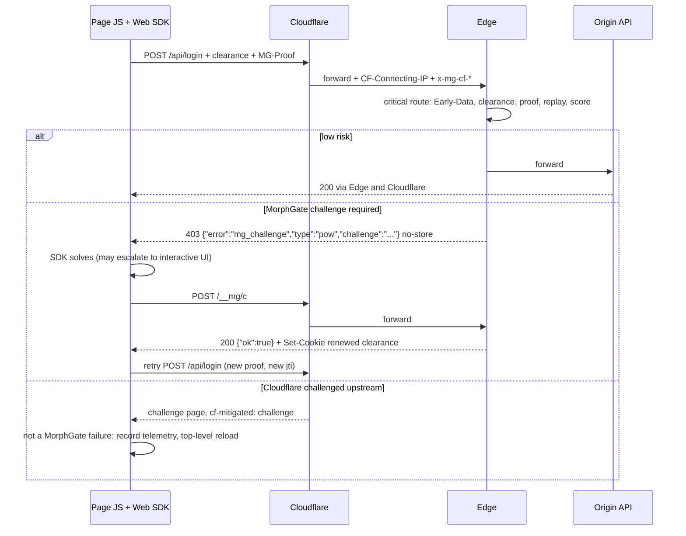

# 04 Challenge 与访问凭证

结论先行：

- Challenge 的价值来自**服务端密封且一次性的 nonce、与会话密钥 / UA / IP 前缀的绑定、PoW 成本、服务端评分和签发配额**，不来自题目难度。通过任何 Challenge 都只是封顶的人类证据（[03](03-risk-scoring.md) §4.1）。
- 默认形态是 `cloudflare` UpstreamProfile，JA4 不可用。凭证按阶段绑定：Phase 1 为 `uah`（硬）+ `ipp`（软），Phase 2 起加 `cnf.jkt`（硬）；`ctp` 只 shadow，`tfp` 只在 `direct_tls`（§5）。
- 分工：本文负责通用 Challenge、凭证、持有证明、防重放、限速与协议约定；交互式 Challenge（按住验证、无障碍路径、密封 C 字段、Provider、Turnstile、交互评分）见 [09](09-interactive-challenge.md)；Cloudflare 侧配置见 [08](08-upstream-and-cloudflare.md)。
- Web SDK 是重点；移动端（设备证明、Mobile SDK）后期 / 按需。

**Phase 1 实现状态**（2026-09-28 勘误）：下表是 Phase 1 实际交付的做法，细节只写在 [Phase 1 实现规格](impl/phase1-spec.md)（两者冲突时以规格为准；D-xx 见规格 [§0.3](impl/phase1-spec.md#03-决定与偏离)，I-xx 见[集成者裁决](impl/phase1-spec.md#集成者裁决2026-09-28优先于正文)）。正文各节的"Phase 1"段落给出与设计的差异。

| 主题 | Phase 1 做法 | 规格 |
|---|---|---|
| Challenge 类型 | 只有 `invisible` 与 `pow`；规则或矩阵要求 `interactive` 时按 `pow` 执行（D-08）；`step_up`、`attestation` 与 TARPIT 在配置包构建与 Edge 加载时被拒（I-19、D-09） | [§5.5](impl/phase1-spec.md#55-默认处置矩阵wp-r1)、[§6.2](impl/phase1-spec.md#62-密封-c) |
| 端点 | `POST /__mg/c`、`GET /__mg/s/<file>`、`/__mg/healthz`；`/__mg/c/renew`、`/__mg/r`、`/__mg/t` 返回 404 | [§10.1](impl/phase1-spec.md#101-端点) |
| 失败后升级 | 新 C 一律为 `pow`，风险段升一级（`very_high` 不变）；失败配额两级；没有交互式可升（D-27、D-28、I-10） | [§6.3](impl/phase1-spec.md#63-pow)、[§9.8](impl/phase1-spec.md#98-限速wp-e1b-接线) |
| PoW | Web Worker 中的纯 JS SHA-256，WebCrypto 只做自检（D-12） | [§11.4](impl/phase1-spec.md#114-pow-实现) |
| 凭证 | PASETO v4.local；`lvl` 只有 `invisible` / `pow`（缺省 1800 s）；新增 `sst`、`bind.ipa`、`ruc`；`ipp` 必有（D-29、D-05、I-30） | [§6.5](impl/phase1-spec.md#65-清关凭证paseto-v4local) |
| 绑定 | `uah` 硬；`ipp` 按签发时的 ASN（`ipa`）判软 / 硬；`cnf.jkt` 在 Phase 2 | [§6.4](impl/phase1-spec.md#64-绑定哈希与返回路径) |
| 配额 | 提交限速、失败配额、签发配额都强制执行（429，D-37） | [§9.8](impl/phase1-spec.md#98-限速wp-e1b-接线) |
| 客户端 IP 未知 | 不签发 C 与凭证（429 + `Retry-After: 5`，D-23） | [§9.3.2](impl/phase1-spec.md#932-客户端-ip-未知d-23) |
| http 访客 | 挑战前 308 到 https（D-32） | [§9.9](impl/phase1-spec.md#99-动作执行wp-e1a-转发与源站头e1b-阻断与限速e1c-挑战) |
| 未实现 | 持有证明（`MG-Proof`、`cnf.jkt`）、凭证刷新、吊销集、SDK 页面注入与遥测、交互式与 Provider（Phase 2–3） | [§0.1](impl/phase1-spec.md#01-范围) |

## 1. 各机制的防护目标

| 机制 | 防什么 | 不防什么 |
|---|---|---|
| 无感 JS Challenge | 不执行 JS 的脚本客户端；同时收集环境信号 | 能执行 JS 的自动化浏览器（靠信号与行为） |
| 工作量证明（PoW） | 抬高大规模请求的边际成本 | 算力充足的少量请求 |
| 交互式 Challenge | 纯自动化；给每次通过加上 PoW 成本、绑定与配额；收集量化交互证据 | 人工辅助 / 打码服务（对各类交互式 Challenge 成功率接近 100%，每千次 $0.10–5，[09](09-interactive-challenge.md) §1） |
| 设备证明（后期 / 按需） | 模拟器、被篡改的 App、非官方客户端 | 真机农场 |
| 短期凭证 | 每请求重复判定的开销；提供会话连续性 | 凭证被导出到别的客户端（由绑定与持有证明解决） |
| 持有证明 | 凭证窃取 / 转移、请求重放 | 控制了客户端本身的自动化；串通的人工代解中继 |
| 限速与签发配额 | 高频滥用、资源消耗、批量收割凭证 | 低频、分布式的慢速滥用（靠实体关联与行为） |

## 2. Challenge 类型

| 类型 | 用户感知 | 渠道 | 服务端验证内容 | 阶段 |
|---|---|---|---|---|
| `passive` | 无 | 全部 | 只看信号，不下发 Challenge | Phase 1 |
| `invisible` | 无（约 100–500 ms） | Web | SDK 已执行、环境信号、轻量 PoW、与 nonce 绑定 | Phase 1 |
| `pow` | 无感或轻微延迟 | Web / 带 SDK 的 API 客户端 | 难度自适应的 PoW | Phase 1 |
| `interactive` | 需要交互 | Web | 选定的 Provider（默认 `self_hold`）+ PoW + 量化交互遥测，必须提供无障碍路径（[09](09-interactive-challenge.md)） | Phase 2 |
| `step_up` | 视情况 | 敏感操作 | 单次操作的持有证明（§6.1，带 `bh` 与服务端 nonce），可叠加 PoW / 交互 | Phase 2 |
| `attestation` | 无 | Mobile | 平台设备证明 + 服务端校验 | 后期 / 按需 |

- 交互式 Provider：`self_hold`（默认）、`pow_a11y`（无障碍）、`turnstile`（可选，非大陆）、`tencent` / `aliyun_v2`（可选，Phase 4）。由 Decision Core 选定并密封进 C，客户端不能选。接口、选择与回退见 [09](09-interactive-challenge.md) §6–§7，签发的 `lvl` 见 §5。
- 移动端（后期 / 按需）：iOS 用 App Attest；Android 有 GMS 时用 Play Integrity，国内大量设备没有 GMS，退化为 Android Key Attestation（可用性因厂商而异）+ SDK 信号；鸿蒙待调研。

## 3. 流程

时序以 `cloudflare` profile 为例：Cloudflare 终止客户端 TLS，经 Tunnel 或 AOP 回源到 Edge；Edge 只在上游认证通过时采信 `CF-Connecting-IP` 与 `x-mg-cf-*`（[08](08-upstream-and-cloudflare.md)）。`direct_tls` 下去掉 Cloudflare 一跳。

### 3.1 状态机

```
NONE --risk requires--> ISSUED(type, providers)
ISSUED --solved--> CLEARED(lvl) --refresh (PoP, ~80% of TTL)--> CLEARED
ISSUED(interactive) --renew (~80% of exp, not mid-hold)--> ISSUED(interactive, fresh C)
ISSUED(invisible | pow) --failed--> ISSUED(interactive)
ISSUED(interactive) --failed--> ISSUED(interactive, fresh C, attempt_no + 1)
ISSUED(interactive) --failed x N--> ISSUED(interactive, other provider | a11y path)
ISSUED(interactive) --failed x M--> BLOCKED(429, Retry-After) --> NONE
ISSUED --expired, not renewed--> NONE
CLEARED --binding violation / replay / risk spike--> REVOKED --> NONE
```

| 转移 | 规则 |
|---|---|
| renew | 仅 `interactive`。SDK 在 C 寿命约 80% 时调用 `POST /__mg/c/renew {C, jwk, sig}`，**按住进行中不续期**。要求旧 C 未过期、未使用、绑定一致；Edge 先用 `SET NX` 消费旧 nonce，再签发新 C（新 nonce、`iat`、`exp`，继承 `type` / `providers` / `risk_band` / `attempt_no` / `ret` / `ui_seed`）。不计为失败。每条续期链上限 6 次（约 1 小时）；超出上限或旧 C 已过期（如标签页休眠）时返回 `mg_challenge_failed` 并附新 C（计入签发配额、不计失败，§9）。用户不必和倒计时赛跑（WCAG 2.2.1） |
| failed | 统一失败响应（§9），附新 C：重新随机化 `ui_seed`、PoW 参数与按住时长 |
| failed × N / × M | 初值 N = 2：换 Provider 或突出无障碍路径；M = 5：临时阻断，`429` + `Retry-After`。评分阈值见 [09](09-interactive-challenge.md) §11.3 |
| refresh | 见 §5 |

- 升级路径与 Provider 都由服务端决定。
- **Phase 1**：只有 `invisible` / `pow`，状态机简化为 `ISSUED(invisible | pow) --failed--> ISSUED(pow, risk_band = after_failure(rb))`（新 C 附在失败响应中）；失败配额用尽 → `429` + `Retry-After`；没有 renew 与 refresh（端点返回 404），凭证过期后重新挑战（D-27、D-28）。
- Provider 返回 `Unavailable` / `Misconfigured` 不算用户失败，按其 `on_unavailable` 回退（[09](09-interactive-challenge.md) §7.2）。
- 收到 Cloudflare 的 `cf-mitigated: challenge`（上游挑战）不改变 MorphGate 状态，也不计入失败（§7）。

### 3.2 浏览器导航：无感 Challenge

```mermaid
sequenceDiagram
    autonumber
    participant B as Browser
    participant CF as Cloudflare
    participant E as Edge
    participant V as Valkey
    participant O as Origin
    B->>CF: GET /product/42 (no clearance)
    CF->>E: Tunnel / AOP + CF-Connecting-IP + x-mg-cf-*
    E->>E: authenticate upstream, score 45, confidence 0.2 -> CHALLENGE(invisible)
    E-->>B: 403 challenge page (no-store, private) + sealed C, via Cloudflare, not cached
    B->>CF: GET /__mg/s/{build}.js (content-hashed, edge-cacheable)
    B->>B: env signals, PoW(C); Phase 2+: session key + sig
    B->>CF: POST /__mg/c {C, solution, signals, [jwk, sig]}
    CF->>E: forward (cache Bypass + Skip rule, see 08)
    E->>E: checks in section 4.1 order
    E->>V: EVALSHA mg_nonce_issue (SET mg:n:{site}:{nonce} NX PX ttl + issuance quotas)
    E-->>B: 303 -> ret + Set-Cookie __Host-mg_clr, no-store, via Cloudflare
    B->>CF: GET /product/42 + cookie
    CF->>E: forward
    E->>O: forward + MG-Bot-Score / MG-Bot-Class
    O-->>B: 200 via Edge and Cloudflare
```

### 3.3 XHR / API（Web SDK）



### 3.4 交互式 Challenge（概要）

完整时序、Provider 调用、评分与无障碍路径见 [09](09-interactive-challenge.md) §5。与本文相关的约束只有两条：本地检查全部通过后、任何外部 Provider 调用**之前**消费 nonce（§4.1 第 10 步）；续期规则见 §3.1。

### 3.5 移动端设备证明（后期 / 按需）

`POST /__mg/m/attest/init` 取密封 challenge → App 在 Secure Enclave / Keystore 生成硬件密钥 → 平台证明覆盖 `hash(nonce, 公钥)` → `POST /__mg/m/attest {challenge, attestation, 公钥, app signals}` → Edge 校验证书链或调用平台校验 API → 签发 `lvl=attested`、`cnf` 为密钥指纹的凭证 → 之后每个 API 请求附凭证与请求签名。Cloudflare 之后每一跳同样经过 Cloudflare。

## 4. Challenge 实现要点

### 4.1 密封 Challenge 与验证顺序

**无状态**：签发时不写存储，大量索取 Challenge 不能耗尽后端状态。所有类型共用一种格式：prost 编码的 protobuf 消息 `SealedChallengeClaims`，外层 XChaCha20-Poly1305，`aad = host ‖ type ‖ kid`，**绝不用字符串拼接**（ALTCHA CVE-2025-68113 的教训）。字段与编码细节见 [09](09-interactive-challenge.md) §4。密钥：每站点一把长期根密钥 `K_seal_root`（systemd credential 交付，年更或泄露时轮换）；每日 `k_epoch = HKDF-SHA256(K_seal_root, info = "mg-seal-v1" ‖ site ‖ epoch_no)`，Turnstile `cData` 的 `k_bind_epoch` 同法以 info `"mg-bind-v1"` 派生；各 Edge 确定性派生同一 epoch 密钥，无需每日分发，接受当前与上一个 epoch；epoch 密钥泄露不暴露根密钥（[ADR-0005](adr/0005-token-and-sealed-challenge-format.md)）。

**Phase 1 实现**（[规格 §6.1–§6.2](impl/phase1-spec.md#61-密钥与-epoch)）：站点密钥文件 `seal.root.json` 含 1–2 个根，`roots[0]` 封装、全部用于打开，轮换分 add / promote / retire 三步（D-30）；kid 为 `e<epoch_no>`；HKDF info 各段以 `0x00` 分隔、`epoch_no` 为 u64be；接受的 epoch 收紧为：当前 epoch，日界后 125 s 内另接受上一个，日界前 5 s 内另接受下一个；`aad` 各段带 u16be 长度前缀；`len(C) ≤ 1024`；`open` 拒绝非规范的信封编码，`seal` 拒绝 `open` 会拒绝的一切（I-18）。

| 类型 | C 有效期 | 到期后 |
|---|---|---|
| `invisible` / `pow` | `exp − iat ≤ 120 s` | 重新请求原资源获取新 C |
| `interactive`（含 `pow_a11y`） | 约 10 分钟 | SDK 静默续期（§3.1） |

**验证顺序**（`POST /__mg/c`，所有类型相同）：

1. 限速（按 ipp / 会话）。
2. `Early-Data: 1` → `425`（§4.3）。
3. 请求体：带 `Content-Encoding` 一律拒绝（不解压）；≤ 8 KB；schema。
4. 打开 C（AEAD；`aad` 校验 host / type / kid）。
5. `exp`；最短时间窗（`interactive` 的计算见 [09](09-interactive-challenge.md) §11.1）。
6. `provider_id ∈ C.providers`（仅 `interactive`，防降级）。
7. 绑定（§5）。
8. 会话密钥签名（Phase 2 起）：覆盖 `hash(C)`、Provider 载荷哈希、遥测哈希、PoW 解、`ret` 哈希与 `client_ts`。
9. PoW。
10. 消费 nonce：`SET mg:n:{site}:{nonce} NX EX ttl`，`ttl ≥ exp − now + 60 s`。**必须在任何外部 Provider 调用之前**，保证并发重复提交只有一个进入 Provider 校验。
11. `provider.verify`（仅需要出站校验的 Provider，有截止时间）。
12. 评分（交互评分 + 挑战前风险）→ 签发凭证，或统一失败（§9）。

**Phase 1 顺序**（[规格 §10.3](impl/phase1-spec.md#103-post-mgc)；没有 Provider 与会话密钥签名）：

| # | 检查 | 失败 |
|---|---|---|
| 0 | 客户端 IP 未知 | `429`（`ic.no_client_ip`），不计失败 |
| 1 | `Early-Data`（§4.3） | `425`（`ic.too_early`） |
| 2 | Valkey 往返 1：提交限速、失败配额、签发配额 | `429`（`ic.rate_limited` / `ic.issue_quota`） |
| 3 | 请求体：媒体类型、≤ 8 KiB、5 s 内读完、不带 `Content-Encoding`（按收到的原始头判断，`Connection` 选项藏不住它）、字段规则 | 统一失败（`ic.body`），不附新 C |
| 4 | 打开 C | 统一失败（`ic.c_*`），不附新 C |
| 5–8 | 绑定（§5）、PoW、`ret`、基础环境（`auto.webdriver`，`env` 中的 UA 必须是请求 `User-Agent` 的前缀） | 统一失败，附新 C |
| 9 | Valkey 往返 2：`mg_nonce_issue`（消费 nonce 与计签发配额在同一个 Lua 脚本中） | `ic.nonce_reused`；重放存储不可用见下 |
| 10 | 签发凭证 | — |

从第 4 步起，时间判断用正文读完时的时钟（正文最多读 5 s），C 在正文到达期间过期即按过期处理。

- nonce 消费后 Provider 校验失败或超时：换新 C 重来，不重试同一 C。
- nonce 集合：多台 Edge 必须用 Valkey（`mg:n:{site}:{nonce_hex}`）。Phase 1 的进程内重放集合是固定容量的 TTL 集合，从不逐出未过期的 nonce，满时按"重放存储不可用"处理；Valkey 模式下也同时写入；只有单台 Edge 时才可设 `local_replay_authoritative = true`，且早于本进程启动时间签发的 C 仍按不可用处理（覆盖平滑升级窗口，D-35）。
- 重放存储不可用：C 所属路由（C 内 `route_class` 对应的路由，或按 `ret` 匹配的路由）`fail_closed` → `429`（`ic.replay_unavailable`，"稍后再试"）；其余照常签发并记 `ic.replay_unchecked`，这样签发的凭证带 `ruc = true`，`fail_closed` 路由不接受（视为级别不足，重新挑战；`ctx.identity.token.status` 记为 `expired`，决定事件另有顶层字段 `token.replay_unchecked`，I-30）。降级总表见 [01 §8](01-architecture.md#8-部署与高可用)。
- 失败计数：Phase 1 挑战前没有会话，按两级配额计：`mg.c.fail`（`ip` 实体，缺省 5 次 / 600 s）与 `mg.c.fail.prefix`（`ipp`，4 倍），超出 → `429`；`ic.c_expired`（标签页休眠）、`ic.replay_unavailable`、`ic.no_client_ip`、`ic.issue_quota`、`ic.rate_limited`、`ic.too_early` 不计失败（D-28）。失败后附的新 C 为 `pow`、风险段 `max(rb, min(rb + 1, high))`（D-27、I-10）；无感 / PoW 失败升级为交互式在 Phase 2。
- 失败响应统一，不返回原因，避免成为调试"预言机"；原因只进内部 reason code 与日志（[09](09-interactive-challenge.md) §12.4）。Phase 1 的 reason code（`ic.*`）只写入 `kind=feedback` 事件（[规格 §13.3](impl/phase1-spec.md#133-kindfeedbackvl-main)）。

### 4.2 PoW

- SHA-256 hashcash `sha256-hashcash-v1`：`digest = SHA-256("mg-pow-v1" ‖ 0x00 ‖ SHA-256(C) ‖ u64be(counter))`，前导零位数 ≥ 难度即通过；Rust 侧校验开销可忽略。浏览器端用纯 JS SHA-256 在 Web Worker 中同步搜索（前缀预先填好，每次尝试只做一次压缩），WebCrypto 只做启动自检：`crypto.subtle.digest` 逐次异步调用，慢一个数量级以上（D-12）；Worker 不可用时在主线程分片计算（[规格 §11.3–§11.4](impl/phase1-spec.md#113-挑战客户端流程)）。
- 难度由风险分段与设备类别决定，中位设备耗时：低风险 0，中风险 ≤ 0.3 s，高风险 ≤ 1.5 s；`pow_a11y` 中位 3–8 s。交互式把 PoW 放在按住期间的 Web Worker 中（[09](09-interactive-challenge.md) §2.1）。Phase 1 不按设备类别区分：配置包 `challenge.pow_bits` 缺省 low 14、medium 16、high 18、very_high 20 位（每项 8–24）；`invisible` 固定取 low，`pow` 取风险段难度（D-27）；实际耗时在 monitor 周用自有流量校准。
- 受攻击模式下整体提高难度（Phase 1 由所有者改站点 YAML 的 `pow_bits` 实现）。内存困难 / 抗 GPU PoW 放到 Phase 5（[09](09-interactive-challenge.md) §14）。
- 定位是成本杠杆，不是识别手段。

### 4.3 Early-Data（0-RTT）

首选关闭 0-RTT：Cloudflare 侧保持默认关闭（其行为与 `mgctl cf audit` 检查项见 [08 §2.7](08-upstream-and-cloudflare.md#27-与-cloudflare-自带功能共存)），`direct_tls` 下 Edge 监听器也不启用。若开启，Edge 按下表处理带 `Early-Data: 1` 的请求。

| 请求 | 处理 |
|---|---|
| `/__mg/*` 状态变更端点：`/__mg/c`、`/__mg/c/renew`、`/__mg/r`、`/__mg/m/*` | 带 `Early-Data: 1` 一律返回 `425` |
| 其他请求 | 视为可重放：不签发 / 刷新凭证，不消费 nonce，不写一次性状态；`critical` 路由返回 `425` |

Cloudflare 是否把源站的 `425` 回传浏览器、浏览器是否自动重试，需实测（规格 [§19](impl/phase1-spec.md#19-待实测与未决)）；在此之前以"保持关闭"为主。

**Phase 1 实现**：请求中出现任何 `Early-Data` 头都视为早期数据，不论取值、个数，也不论是否被 `Connection` 列出（RFC 8470 §5.1；`Connection` 只决定转发前删除哪些头，从不对 Edge 自己的检查隐藏字段）。`POST /__mg/c` → `425 {"error":"mg_too_early"}`（`ic.too_early`，不计失败）。`critical` 路由上本应转发的决定（ALLOW / TAG / LOG）→ `425`；BLOCK 仍为 403，CHALLENGE 照常下发（签发 C 不写状态）；凭证只在 `/__mg/c` 签发，所以早期数据永远拿不到凭证。monitor 下只记录（`http.early_data`）。

### 4.4 缓存

Free / Pro / Business 下 Cloudflare 的 Origin Cache Control 始终开启，`no-cache` / `max-age=0` 仍会被缓存，所以只用 `no-store`。

| 响应 | 头 |
|---|---|
| `GET /__mg/s/{build}.js`（内容哈希构建） | `Cache-Control: public, max-age=31536000, immutable`，允许 Cloudflare 边缘缓存 |
| 其他所有 `/__mg/*` | `Cache-Control: no-store, private` |
| Challenge 页面与 JSON Challenge | `403`（限速 / 超限为 `429`），不用 200；`no-store, private`；HTML 另加 `X-Robots-Tag: noindex` |

Phase 1：Edge 生成的所有响应都带 `no-store, private` 与 `X-Content-Type-Options: nosniff`（`/__mg/s/*` 除外；Pingora 解析器自己生成的 400 不带 `nosniff`，见 [Phase 1 进度记录](impl/phase1-status.md#4-已知的低优先级遗留)）；HTML 另加 `X-Robots-Tag: noindex`、`Referrer-Policy: same-origin`、`X-Frame-Options: DENY` 与 CSP（挑战页为带 nonce 的 CSP，其余为 `default-src 'none'`，规格 [§9.9](impl/phase1-spec.md#99-动作执行wp-e1a-转发与源站头e1b-阻断与限速e1c-挑战)、[§10.2](impl/phase1-spec.md#102-挑战页与-json-challenge)）。挑战页经 Cloudflare 后是否仍为 `cf-cache-status: DYNAMIC` / `BYPASS` 在 monitor 周抽查。

Cloudflare 侧另需一条放在**最后**的 `/__mg/` Bypass Cache Rule（`/__mg/s/` 除外），并禁止"Eligible for cache + 覆盖 Edge TTL"的规则覆盖可能返回 Challenge 的路径；表达式与 `mgctl cf audit` 检查项见 [08 §2.6](08-upstream-and-cloudflare.md#26-缓存)。

## 5. 短期访问凭证

**格式**：PASETO v4.local（pasetors 0.8），对客户端不透明，不泄露分数与分类；Edge 按站点持有密钥，按 `kid` 轮换。源站需要独立验证时，另签一枚只含最少字段的 v4.public（Ed25519）凭证。

```json
{
  "v": 1, "kid": "blog-t-20260927",
  "sid": "site", "env": "production",
  "sub": "pseudonymous session id (base64url of 16 random bytes)",
  "sst": 1790000000,
  "lvl": "invisible | pow | interactive | interactive_a11y | interactive_ext:{provider}",
  "iat": 1790000000, "exp": 1790001800,
  "cnf": { "jkt": "JWK thumbprint of the SDK session key (Phase 2+)" },
  "bind": {
    "uah": "hash(ua family + major)",
    "ipp": "hash(ip /24 | /48)",
    "ipa": "hash(ASN); only when the ASN is known and not 0",
    "ctp": "hash(tls_version, cipher, ciphers_sha1, hello_len bucket); cloudflare only, shadow",
    "tfp": "JA4-derived hash; direct_tls only, not before Phase 2 (ADR-0002 erratum)"
  },
  "rb": "risk band at issuance",
  "jti": "unique id (base64url of 16 random bytes)",
  "ruc": "true only when issued without a replay check (omitted otherwise)"
}
```

| 项目 | 设计 |
|---|---|
| `lvl` | `invisible`、`pow`、`interactive`（`self_hold`）、`interactive_a11y`（`pow_a11y`）、`interactive_ext:{provider}`（`turnstile` / `tencent` / `aliyun_v2`）；`attested` 保留给后期移动端。三种交互级的人类证据封顶相同（[03](03-risk-scoring.md) §4.1 的 −0.8）。Phase 1 只签发 `invisible` 与 `pow`，两者的人类证据相同（−0.4），级别只决定能满足哪种挑战要求 |
| 有效期 | Phase 1：`invisible` / `pow` 缺省 1800 s（每项 60–86400 s），`exp − iat ≤ 86400`。设计：`invisible` / `pow` 15–30 分钟；`interactive`、`interactive_ext:*` 30 分钟；`interactive_a11y` 15 分钟且配额更严；`attested`（后期）1–24 小时，配合每请求签名；静默刷新可延续到站点配置的会话上限；`critical` 路由可要求最低级别与最大凭证年龄 |
| 级别要求 | "交互级"同时包含 `interactive`、`interactive_a11y`、`interactive_ext:*`，不得把无障碍路径排除在外。凭证在站点的整个环境内有效（`sid` + `env`），不区分路由：路由只按级别与 `ruc`（§4.1）判断是否满足 |
| 会话 | `sub` 与 `sst`（会话开始，Unix 秒）只从通过站点 / 环境校验、没有硬绑定失败且 `now − sst ≤ session_max_s`（缺省 86400）的凭证沿用（可以已过期），否则开始新会话；重签不延长会话上限（D-29） |
| 校验 | footer `{"kid"}` 选密钥，implicit assertion 绑定站点；`kid` 形如 `<site>-t-<YYYYMMDD>`（I-14）；状态 `none`、`valid`、`expired`（含未知或已退役的 kid，按 ABSENT 处理）、`invalid`、`binding_mismatch`（[规格 §6.5](impl/phase1-spec.md#65-清关凭证paseto-v4local)） |
| 存储 | Web：`__Host-mg_clr`，`HttpOnly; Secure; SameSite=Lax; Path=/`，`Max-Age = exp − now`，只出现在 `/__mg/c` 的成功响应上，从不附加到源站响应；移动端（后期）：`MG-Clearance` 请求头 |
| 刷新 | SDK 在寿命 80% 时调用 `POST /__mg/r`，附持有证明与最新遥测；服务端重新评分，风险升高则拒绝刷新并要求 Challenge（Phase 2；Phase 1 凭证到期后重新挑战） |
| 签发配额 | 按 ipp / ASN 限制凭证签发数，监控解题时间分布，对抗人工代解中继的批量收割（[09](09-interactive-challenge.md) §13）。Phase 1 强制执行：`mg.clr.issue.ipp` 缺省 60 / 小时、`mg.clr.issue.asn` 600 / 小时，超额 `429`（`ic.issue_quota`）；与 nonce 消费在同一个 Lua 脚本中完成，nonce 已用过时不计配额（D-37） |
| 吊销 | （Phase 3）以短寿命为主；紧急吊销按 `sub` / `jti` 写入吊销集 `mg:rev:{site}`（成员随凭证寿命过期），Edge 本地用布隆过滤器加速（[02](02-data-flow.md)） |

**绑定策略**（C 的 `bind` 与凭证同口径）

| 绑定项 | 适用 profile | 阶段 | 强度 | 不一致时 |
|---|---|---|---|---|
| `uah`（UA 家族 + 主版本） | 全部 | Phase 1 | 硬 | 重新 Challenge |
| `ipp`（IP 前缀，v4 /24、v6 /48） | 全部 | Phase 1 | 软 | 前缀变化时：签发时绑定了 `ipa`（ASN）且当前 ASN 已知、相同 → 软结果（风险信号 `identity.bind_ipp_soft`）；其余（含当前 IP 未知）→ 硬失败，重新 Challenge（D-05；不按国家判断） |
| `cnf.jkt`（SDK 会话密钥） | 全部 | Phase 2 起 | 硬 | 持有证明失败即拒绝并重新 Challenge |
| `ctp`（`x-mg-cf-tls-*` 的 TLS 版本、cipher、套件哈希、ClientHello 长度分桶） | 仅 `cloudflare` | Phase 1 起，仅 shadow | 只记录；稳定性 ≥ 99% 后才可转为软绑定（[03](03-risk-scoring.md) §3.4） | shadow 期只记录 |
| `tfp`（JA4 派生哈希） | 仅 `direct_tls` | 待定（Phase 2 前不启用） | 预研结论：原始 JA4 随 TLS 1.3 会话恢复与 ClientHello 长度变化，不做硬绑定；候选取恢复时不变的部分，与 `ctp` 同样先 shadow，稳定性 ≥ 99% 后才考虑软绑定（[ADR-0002 勘误](adr/0002-edge-pingora-boringssl.md#bindtfp-的建议)） | shadow 期只记录 |

- `cloudflare` profile 下 Edge 看到的是 Cloudflare 自己的回源 TLS，访客 JA4 只有 Enterprise Bot Management 提供（超出预算），因此不启用 `tfp`。
- `ctp` 不含扩展哈希：其排序与 GREASE 处理未文档化，未经实测不得用于绑定或高权重。
- `ipp` 依赖可信客户端 IP：只取认证上游的 `CF-Connecting-IP`，从不用 `X-Forwarded-For[0]`（[08](08-upstream-and-cloudflare.md) §2.2）。客户端 IP 未知时不签发 C 与凭证（`429` + `Retry-After: 5`），C 与凭证恒带 `ipp`（D-23）。
- `cloudflare` 下访客用 http 时 `__Host-` Cookie 无法保存：Edge 对 GET / HEAD 的挑战改为 308 到 https（`mg_https_redirect_total`），`mgctl cf audit` 第 21 项要求开启 Always Use HTTPS（D-32）。

**可选：Cloudflare 放行 Cookie**（Pro 及以上）：另签 `__Host-mg_cfp`（MessageMAC 格式、独立密钥），供 Cloudflare 规则校验后跳过其通用 Bot 功能、避免双重挑战。它不是 MorphGate 凭证，也不是人类证据；规则写法及限速是否可跳过见 [08](08-upstream-and-cloudflare.md) §2.7、§2.9。

## 6. 持有证明、防重放与限速

### 6.1 请求级持有证明（参考 RFC 9449 DPoP）

Phase 2 起，SDK 在 Challenge 时生成会话密钥（Web：WebCrypto ECDSA P-256，non-extractable，存 IndexedDB；移动端后期用 Secure Enclave / Keystore），凭证以 `cnf.jkt` 绑定该密钥。受保护请求携带：

```
MG-Proof: <compact JWS, ES256, header.jwk = session public key>
  payload: { htm, htu, iat, jti, ath = hash(clearance), bh = hash(body) }   // bh: critical routes only
```

- **校验**：签名有效；`thumbprint(jwk) == cnf.jkt`；`htm` / `htu` 与请求一致；`|now − iat| ≤ 30 s`；`ath` 匹配；`bh` 匹配请求体；`jti` 未出现过（`SET mg:jti:{site}:{jkt}:{jti} NX EX 60`）。
- **服务端 nonce**：最高风险操作要求带上前一个响应下发的 `MG-Nonce`，防止预先批量生成证明。
- `critical` 路由强制，其他路由可选。它证明"请求来自持有该密钥的客户端且未被重放"，**不证明是人**。
- 所有一次性状态以会话 / 密钥 / nonce 为键，**不以下游连接为键**：Cloudflare 的回源连接被多个访客复用。

### 6.2 其他防重放点

- Challenge nonce 一次性使用（§4.1）；续期时旧 nonce 同样被消费（§3.1）。
- 第三方 Provider token：哈希写入 `mg:rp:*` 重放集合，TTL = token 寿命（[09](09-interactive-challenge.md) §12.1）。
- `Early-Data: 1` 的请求视为可重放（§4.3）。
- Agent 签名：`created` / `expires` 窗口 + `nonce` 重放缓存（[05](05-ai-agent-policy.md)）。
- 凭证 `jti` 与吊销集。

### 6.3 限速

| 设计点 | 方案 |
|---|---|
| 维度 | ip、ip 前缀（v4 /24、v6 /48 或 /56）、asn、会话、设备、账号（从请求体字段或源站回传头提取并哈希）、Agent、指纹簇（JA4 + UA）、路由，以及组合键 |
| 算法 | GCRA（单 key、O(1)、Valkey Lua 原子执行）；需要"每窗口 N 次"语义时用滑动窗口；昂贵接口用带租约的并发上限 |
| 两级 | 本地内存限速挡住明显洪泛；精确的低频限额（如每账号 15 分钟 5 次登录）走 Valkey |
| 高基数 | Count-Min Sketch / heavy hitter 找出头部来源，再提升为精确跟踪 |
| 自适应 | 按路由维护周内时段基线（EWMA），超过 k·σ 告警或收紧；受攻击模式整体收紧 |
| 超限动作 | 信号 / Challenge / 429 / 阻断；每个限速器可先 log-only |

```yaml
rate_limits:
  - id: login-per-account
    match: { route: login }
    key: [account]              # from JSON body field "username", hashed
    algorithm: gcra
    rate: 5/15m
    burst: 3
    on_exceed: { action: challenge, type: interactive }
  - id: api-per-prefix
    match: { channel: api }
    key: [ip_prefix]
    rate: 600/1m
    on_exceed: { action: signal, weight: 1.5 }
```

- 指纹簇在 `cloudflare` profile 下没有 JA4，以 UA 家族为主，`ctp` 只在 shadow 中参与。
- **Phase 1 实现**（[规格 §9.7–§9.8](impl/phase1-spec.md#97-状态层valkeywp-c3-实现wp-e1b--e1c-接线)；站点 YAML 语法见 [§8.2](impl/phase1-spec.md#82-站点-yaml-v1wp-g2)，上面的 YAML 是设计示意）：

| 项 | Phase 1 |
|---|---|
| 算法 | 只有 GCRA。`scope: global` 经 Valkey Lua `mg_gcra`（失败时回退进程内同一数学的表），`local` 只用进程内表；没有滑动窗口、并发上限、Count-Min Sketch 与自适应基线 |
| 维度 | `ip`（IPv4 为地址，IPv6 为所在 /64，D-24）、`ip_prefix`（/24、/48）、`asn`、`session`、`route`；账号、设备、指纹簇未实现。IP 或 ASN 未知时用共享兜底值 `?`，从不跳过；`session` 在没有有效凭证时跳过该限速器 |
| 键 | `mg:rl:{site}:{limiter}:{kh}`，`kh` 是所有者假名化密钥 `K_pseudo` 的 HMAC（D-06）；限速器 id 在整个站点内唯一（I-23） |
| 超限 | `signal{weight}`、`challenge{invisible\|pow}`、`rate_limit{retry_after_s}`、`block`；`mode: dry_run` 只记录；计 `mg_ratelimit_exceeded_total{limiter}` |
| Challenge 端点 | 内置 `mg.c.submit`（按 `ipp`）、`mg.c.fail`、`mg.c.fail.prefix`、`mg.clr.issue.ipp`、`mg.clr.issue.asn`，参数来自配置包 `challenge` |
| 往返 | 普通请求一次（verdict `MGET` + 全部 global 限速器）；`/__mg/c` 两次 |
- Challenge 端点自身受限：按 ipp / 会话限制 Challenge 签发与 `/__mg/c`、`/__mg/c/renew` 提交；按 ipp / ASN 限制凭证签发（§5）。交互式的具体限速器见 [09](09-interactive-challenge.md) §12.3。
- **Cloudflare 边缘泄压**：Free 区唯一一条限速规则可用于在边缘挡 `POST /__mg/` 洪泛，阈值远高于 Edge 限额，精确限额仍由 Edge 负责。使用这条规则的 zone，`/__mg/` 的 Skip 规则**不得**跳过 `http_ratelimit`；规则约束见 [08 §2.7](08-upstream-and-cloudflare.md#27-与-cloudflare-自带功能共存)。

## 7. 客户端信号采集（Web / Mobile SDK）

**原则**

- Web SDK 优先（Phase 2 交付）；Mobile SDK 后期 / 按需。
- 最小必要：端上计算摘要，不上传渲染图像、按键内容、表单值、原始轨迹。
- 高熵指纹（画布 / 音频渲染哈希等）默认关闭，仅在所有者开启并完成合规评审后作为一致性特征，短期保留，不做跨站追踪（[06](06-policy-console-observability.md#7-隐私与合规)）。
- 性能：核心包 gzip 后 ≤ 30 KB，行为模块懒加载，空闲时采集，不阻塞首屏。
- 第一方：SDK、按住组件与 PoW Worker 都从本站 `/__mg/` 下发，不依赖第三方域名、字体或统计脚本，保证大陆访客可用。
- 稳健：SDK 异常不影响页面功能；SDK 失败时相关 CLIENT 信号记为 `ABSENT`（[03](03-risk-scoring.md) §3.1）。

**Phase 1 实现**：SDK 只在挑战页运行（[规格 §11](impl/phase1-spec.md#11-web-sdk-phase-1wp-w1)）。在 Web Worker 中求解 PoW（Worker 收到有效请求立即回 `mg-pow-ack`；创建失败或 2 s 内无任何回复时改为主线程分片计算，60 s 未完成显示重试链接）；采集 `env`（EnvSummary `v = 1`，探测无结果为 `null`）与 `auto.webdriver`；以只含字段 `mg` 的隐藏表单提交并跟随 303。页面注入、behavior、crypto、transport 与 `/__mg/t` 在 Phase 2。挑战页模板的占位符只允许出现在带引号的属性值或普通文本中，Edge 加载 SDK 目录时按与 `validateTemplate` 相同的规则校验（I-28）。`kind=telemetry` 只在提交携带 `env` 时写出，按已知字段、带长度上限重新序列化，不含 `userAgent`（I-32）。

**Web SDK 模块**

| 模块 | 内容 |
|---|---|
| env | UA 与 Client Hints、语言、时区、屏幕与视口、硬件并发、触控能力、图形栈家族摘要、存储可用性 |
| automation | 标准 WebDriver 标志、无头环境特征、自动化注入痕迹、关键原生函数完整性 |
| behavior | 指针 / 键入 / 滚动 / 触控的统计摘要，按页面批量上报（`POST /__mg/t`） |
| challenge | 渲染服务端选定的 Provider、Web Worker 中运行 PoW、量化交互遥测、C 续期（[09](09-interactive-challenge.md)） |
| crypto | 会话密钥、提交签名、请求级持有证明 |
| transport | 可选的 fetch / XHR 包装：为受保护路由附加 `MG-Proof`；处理 `mg_challenge` / `mg_challenge_failed` 并重试；识别 `cf-mitigated: challenge` |

**在 Cloudflare 之后**（配置细节见 [08](08-upstream-and-cloudflare.md) §2.7–§2.8）

- 注入的 SDK 标签带 `data-cfasync="false"`（放在 `src` 之前）与 CSP nonce，例如 `<script data-cfasync="false" src="/__mg/s/{build}.js" nonce="..."></script>`，避免 Rocket Loader 改写；或直接关闭 Rocket Loader。
- 对 `/__mg/*` 或受保护 fetch 收到 `cf-mitigated: challenge`：视为"上游挑战"，不算 MorphGate 失败，本地记录后顶层重载，随下一批遥测上报，计入 `mg_double_challenge_total`。
- Cookie 类信号忽略 Cloudflare 自有 Cookie（`__cf_bm`、`cf_clearance`、`_cfuvid` 等）；`cf_clearance` 永不作为 MorphGate 证据。
- Turnstile 只在选用它的页面按官方方式加载（[09](09-interactive-challenge.md) §8.2）。

一致性判断放在服务端，SDK 只负责采集：属性之间，以及与服务端观测到的 UA、TLS（`direct_tls` 为 JA4 家族；`cloudflare` 为 `EDGE_TLS` 族，低权重、shadow）、IP 地理（含 `cf-timezone`，弱信号）之间。

**Mobile SDK 模块（后期 / 按需）**

| 模块 | 内容 |
|---|---|
| attestation | iOS App Attest；Android Play Integrity（有 GMS）/ Key Attestation；鸿蒙待调研 |
| app integrity | 包签名校验、调试器 / 注入 / Hook 检测、Root / 越狱检测、模拟器检测 |
| keys | Secure Enclave / Android Keystore（优先 StrongBox）中的不可导出密钥 |
| device | 系统版本、机型、传感器可用性摘要；只用应用范围内的随机 ID，不采集 IMEI 等硬件标识 |
| transport | OkHttp Interceptor / URLSession 封装：附加凭证与请求签名，处理 Challenge |

端上完整性检测会被有能力的对手绕过，定位是成本抬升；以服务端验证的设备证明为主。

## 8. Morph 动态变形

目的：让客户端逻辑和部分请求特征不再静态不变，抬高针对本站编写和维护自动化脚本的成本。它补充而不替代服务端验证。

| 能力 | 做法 | 阶段 |
|---|---|---|
| SDK 多态构建 | 按 epoch 生成多个变体（含 `self_hold` 组件）：标识符随机化、控制流平坦化、字符串加密、模块重排、提交载荷编码随机化；服务端按 build ID 解码；旧构建保留宽限期 | Phase 5 |
| Challenge VM | Challenge 逻辑编译为自定义字节码，由 SDK 内的小型解释器执行；每个构建随机化操作码映射；结果与 nonce 绑定，服务端重算验证 | Phase 5 后期 |
| 动态表单字段 | 对登录 / 注册等敏感表单，由 Edge 按会话重命名字段并插入蜜罐字段，转发源站前映射回原名 | Phase 5 |
| 动态接口令牌 | `critical` 接口必须携带基于会话密钥与服务端 nonce 的一次性证明（§6.1）；可选按会话为高价值接口生成路径别名 | 证明：Phase 2；别名：Phase 5 可选 |

**取舍**

- 混淆不是安全边界，所有判定都在服务端验证。
- 静态 SDK 按 epoch 轮换而不是每请求变化，保证 Cloudflare 边缘与浏览器缓存有效；按会话变化只用于本就不可缓存的敏感页面。
- 字段重命名保留 `autocomplete`、`id`、`label` 关联，用主流密码管理器与辅助技术做回归。
- 注入脚本使用 CSP nonce / hash；多态构建与 SRI 冲突时在注入时计算 integrity。
- 第三方 Provider 脚本（含 Turnstile api.js）按官方方式直连加载，**永远不进入 Morph 构建**或 `/__mg/` 路径。
- 可调试性：每个 build ID 保存映射与私有 source map；支持按站点临时关闭 Morph。

## 9. 协议约定

本节是 `/__mg/*` 与 Challenge 响应的唯一口径，[09](09-interactive-challenge.md) 引用本节。

| 场景 | 响应 |
|---|---|
| HTML 导航需要 Challenge | `403` + Challenge 页面，`no-store, private`，`X-Robots-Tag: noindex`；脚本带 CSP nonce 与 `data-cfasync="false"` |
| API / XHR 需要 Challenge | `403` + `{"error":"mg_challenge","type":"...","challenge":"...","retry":true}`，响应头 `MG-Challenge`，`no-store, private` |
| 请求体 | `/__mg/*` 拒绝任何带 `Content-Encoding` 的请求体（不解压）；上限 `/__mg/c`、`/__mg/c/renew` 8 KB，`/__mg/t`、`/__mg/r` 16 KB（[02](02-data-flow.md) §3）；不合规时 `/__mg/c` 按 Challenge 失败处理，其余端点直接拒绝 |
| `POST /__mg/c` 成功 | 页面导航提交：`303` → 已校验的同站 `ret`；fetch 提交：`200` + `{"ok":true}`；均带 `Set-Cookie: __Host-mg_clr` 与 `Cache-Control: no-store, private` |
| Challenge 失败（任何原因） | `403` + `{"error":"mg_challenge_failed","retry":true,"request_id":"...","challenge":"<new C>"}`；HTML 为通用失败页（中性文字、帮助链接、request_id）；不区分原因 |
| 交互式失败超过 M 次（初值 5） | `429` + `Retry-After` |
| `POST /__mg/c/renew` | `200` + `{"challenge":"<new C>","exp":...}`，`no-store, private`，旧 C 作废；不可续期时返回 `mg_challenge_failed`（附新 C，计入签发配额，不计入失败次数） |
| `POST /__mg/r` 凭证刷新 | 成功 `200` + `Set-Cookie`；风险升高则 `403` + `mg_challenge` |
| 状态变更端点带 `Early-Data: 1` | `425`（§4.3） |
| 需要持有证明或服务端 nonce | `403` + `{"error":"mg_proof_required"}`，响应头 `MG-Nonce` |
| 限速 | `429` + `Retry-After` |
| 阻断 | `403` 通用页面或 `{"error":"mg_blocked","request_id":"..."}` |
| 授权 Agent 超出范围 | `403` + `{"error":"agent_scope_denied","request_id":"..."}` |
| 上游 Cloudflare 挑战（非 MorphGate 响应） | Cloudflare 挑战页，带 `cf-mitigated: challenge`；SDK 按 §7 处理 |

所有 `/__mg/*` 响应（内容哈希的 SDK 构建除外）与所有 Challenge 响应都带 `Cache-Control: no-store, private`（§4.4）。

**Phase 1 实际响应**（[规格 §9.9](impl/phase1-spec.md#99-动作执行wp-e1a-转发与源站头e1b-阻断与限速e1c-挑战)、[§10](impl/phase1-spec.md#10-http-接口wp-e1c)；上表中持有证明、`renew`、`/__mg/r`、Agent 各行在 Phase 2–3）：

| 场景 | Phase 1 响应 |
|---|---|
| 导航请求需要 Challenge（`Sec-Fetch-Mode: navigate`，或没有该头且 `Accept` 含 `text/html`） | `403` 挑战页（模板渲染，带 nonce 的 CSP，C 在 `data-mg-c`）；HEAD 只返回头 |
| 其他请求需要 Challenge | `403` + `MG-Challenge: <type>` + `{"error":"mg_challenge","type","challenge","pow":{"alg","bits"},"ret","retry":true,"request_id"}` |
| 客户端 IP 未知时需要 Challenge | `429` + `Retry-After: 5`，不签发 C；事件照录引擎的决定 |
| http 访客的 GET / HEAD 需要 Challenge | `308` 到 https |
| `POST /__mg/c` 请求 | 表单导航（`application/x-www-form-urlencoded`，恰好一个字段 `mg`，`+` 解码为空格）或 fetch（`application/json`）；`charset` 若有只能是 `utf-8` |
| 提交成功 | 表单：`303` → `ret`；fetch：`200 {"ok":true,"ret":"…"}`；均带 `Set-Cookie: __Host-mg_clr` |
| 提交失败 | `403` 挑战页（`state = failed`，附新 C 时每个 `ret` 自动重试一次）或 `{"error":"mg_challenge_failed","retry":true,"request_id","challenge","type","pow"}`；请求体或 C 本身无效时不附新 C |
| 提交限速、失败配额、签发配额 | `429` + `Retry-After`；JSON 为 `{"error":"mg_rate_limited","retry_after":N,"request_id"}` |
| 早期数据 | `425`（§4.3） |
| 阻断 | `403` 通用页或 `{"error":"mg_blocked","request_id"}` |
| `/__mg/c/renew`、`/__mg/r`、`/__mg/t` 与其他保留路径 | `404`；已有端点的其他方法 `405` + `Allow` |

## 10. 参考

- Cloudflare Cache-Control 与 Origin Cache Control：https://developers.cloudflare.com/cache/concepts/cache-control/
- Cloudflare Cache Rules 顺序与设置：https://developers.cloudflare.com/cache/how-to/cache-rules/order/ 、https://developers.cloudflare.com/cache/how-to/cache-rules/settings/
- Cloudflare 0-RTT：https://developers.cloudflare.com/speed/optimization/protocol/0-rtt-connection-resumption/
- Rocket Loader 排除脚本：https://developers.cloudflare.com/speed/optimization/content/rocket-loader/ignore-javascripts/
- 识别 Cloudflare 挑战响应（`cf-mitigated`）：https://developers.cloudflare.com/cloudflare-challenges/challenge-types/challenge-pages/detect-response/
- Cloudflare 限速规则：https://developers.cloudflare.com/waf/rate-limiting-rules/
- JA4 字段（Enterprise Bot Management）：https://developers.cloudflare.com/ruleset-engine/rules-language/fields/reference/cf.bot_management.ja4/
- ALTCHA CVE-2025-68113 公告：https://github.com/altcha-org/altcha-lib/security/advisories/GHSA-6gvq-jcmp-8959
- WCAG 2.2 SC 2.2.1 Timing Adjustable：https://www.w3.org/WAI/WCAG22/Understanding/timing-adjustable.html
- pasetors：https://github.com/brycx/pasetors
