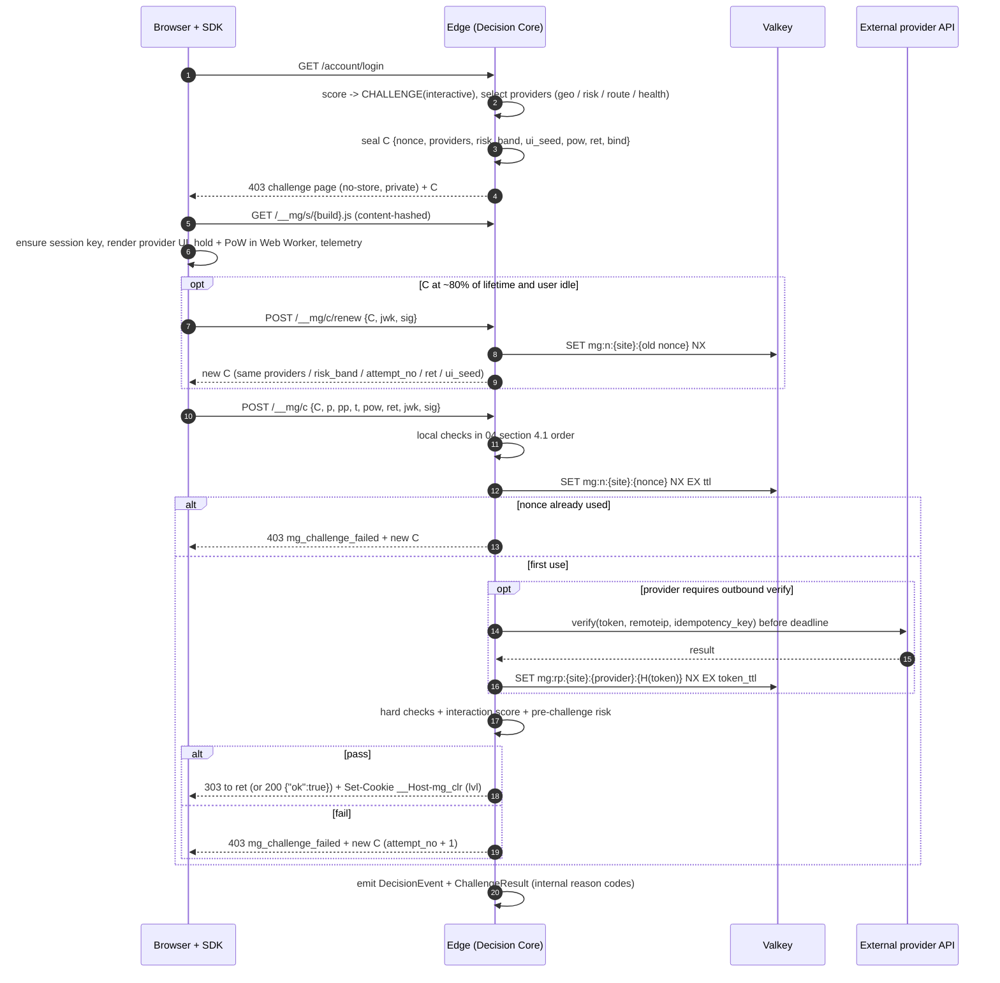

# 09 自研交互式 Challenge 与 Provider

本文是 `interactive` 类型的详细设计：按住验证、无障碍路径、密封 Challenge 格式、Provider 接口与适配（Turnstile、大陆验证码）、交互遥测与评分。通用的验证顺序、凭证与绑定、持有证明、Early-Data、缓存和响应格式以 [04](04-challenge-and-tokens.md) 为准；Cloudflare 侧配置见 [08](08-upstream-and-cloudflare.md)。v1 属于 Phase 2（`self_hold`、`pow_a11y`、`turnstile`），大陆 Provider 为 Phase 4 可选项（[07](07-roadmap.md)）。只覆盖 Web。

Phase 1（2026-09-28 勘误）只交付 §4 的密封格式中 `invisible` / `pow` 用到的部分，以及 §12 的防重放与配额的对应子集；各节的"Phase 1"段落给出实际做法，细节以 [Phase 1 实现规格](impl/phase1-spec.md) 为准（D-xx 见规格 [§0.3](impl/phase1-spec.md#03-决定与偏离)，I-xx 见[集成者裁决](impl/phase1-spec.md#集成者裁决2026-09-28优先于正文)）。规则或矩阵要求 `interactive` 时，Phase 1 按 `pow` 执行（D-08）。

## 1. 定位

**结论**：交互式 Challenge 不是安全边界。谜题难度挡不住自动求解与人工代解，通过只是**封顶的人类证据**（[03](03-risk-scoring.md) §4.1）。它的价值只来自五项服务端机制：

| # | 机制 | 作用 |
|---|---|---|
| 1 | 服务端密封、一次性的 nonce，与会话密钥 / UA / IP 前缀绑定 | 解答不能转移、拼接、重放 |
| 2 | PoW | 每次通过都有算力成本 |
| 3 | 服务端评分的量化交互遥测 | 软证据，筛掉低质量自动化 |
| 4 | 风险自适应升级 | 只对少数高风险会话展示；失败后换 Provider 或临时阻断 |
| 5 | 签发与尝试配额 | 限制单个前缀 / ASN / 会话能拿到的凭证与尝试次数 |

**公开研究**（只列结果数字；预印本仅作参考）

| 来源 | 结果 |
|---|---|
| USENIX Security 2023，1,400 人 / 14,000 次 | 文献中的自动求解在准确率和速度上都优于人：自动 85–100%（多数 > 96%），人 50–85%；Geetest 滑块 人 28–30 s，自动 5.3 s / 96%；扭曲文字 人 9–15.3 s / 50–84%，自动 < 1 s / 99.8% |
| COMPSAC 2024 | reCAPTCHA v2 图像题求解 100% |
| arXiv 2609.18518（2026，预印本） | 免费本地模型，500 个真实会话端到端成功 92.6% |
| Open CaptchaWorld（NeurIPS 2025） | 20 类 225 题：人 93.3%，最佳零样本 Agent 40.0% |
| COGNITION（arXiv 2512.02318，预印本） | 识别类、低交互类任务 MLLM 已达"类人的成本与延迟"；精细定位或多步空间推理较难；差距在缩小 |
| Broken Gates（arXiv 2607.18659，2026，预印本） | 商业求解服务：reCAPTCHA v2 100%、Turnstile managed / invisible 100%、hCaptcha 58–100%，每千次 $0.10–5.00；基于环境的非交互检测（reCAPTCHA v3）平均 23% |
| BeCAPTCHA-Mouse（2022） | 单条轨迹识别高仿真合成鼠标轨迹，平均准确率 93% → 交互遥测只作软证据 |

**推论**

- 交互式 Challenge 只在极少数会话出现：人类会话被交互式 Challenge 的比例 < 0.1%（[03](03-risk-scoring.md) §9）。升级顺序 passive → invisible → pow → interactive 由服务端决定（[03](03-risk-scoring.md#5-分级处置)）。
- 交互本身可以低价外包，因此非交互的无障碍路径（`pow_a11y`）几乎不降低安全性。
- `critical` 路由（登录、注册等）无论 Challenge 结果如何，仍保留每账号限额（[04](04-challenge-and-tokens.md) §6.3）。

**不做**

| 类型 | 原因 |
|---|---|
| 滑块 / 拼图 | 人比自动求解慢（28–30 s vs 5.3 s）；拖动需满足 WCAG 2.5.7；需要持续更新素材 |
| 点选 / 旋转 / 图像识别 | 认知测试（3.3.8 / 3.3.9）；MLLM 在识别类任务上已达类人成本 |
| 扭曲文字 | 认知测试；自动求解 99.8% |
| 音频题 | 认知测试；需要素材流水线 |

大陆访客如需熟悉的滑块，接入 `tencent` / `aliyun_v2`（§9），不自研。

## 2. v1 交互设计

**结论**：自研"按住验证（Hold to verify）"。按住期间在 Web Worker 中运行 PoW，用按住时长掩盖 PoW 延迟。不含认知测试、不是拖动、可键盘操作、第一方 `/__mg/` 提供，大陆可用。

### 2.1 参数

| 参数 | 取值 |
|---|---|
| 交互 | 按住按钮直到进度完成，松开后自动提交 |
| 要求按住时长 | 每次随机 1.2–2.5 s，由 `C.ui_seed` 决定；服务端从 `ui_seed` 重算，不信任客户端上报 |
| 目标尺寸 | ≥ 44×44 CSS px（WCAG 2.5.8 最低 24×24）；位置由 `ui_seed` 在容器内小幅偏移，不改变 Tab 顺序与可访问名称 |
| 提前松开 | 进度回退，提示"请按住稍久一些"，不计失败、不提交 |
| PoW 算法 | SHA-256 hashcash：找 `counter` 使 `SHA-256(C.nonce, pow_salt, counter)`（长度前缀编码）前导零位 ≥ `C.pow.difficulty`；`pow_salt` 由 `ui_seed` 派生；可拆成 k 个低难度子题降低耗时方差 |
| PoW 执行 | 页面渲染时加载 Worker，按下时开始计算；Worker 不可用时主线程分片计算，WebCrypto 不可用时纯 JS；按住已满而 PoW 未完成时显示"正在完成…"，完成后自动提交，不要求继续按住 |
| PoW 难度 | 按 `risk_band`：中风险中位设备 ≤ 0.3 s，高风险 ≤ 1.5 s；按 `pow_solve_ms` 遥测回算校准 |
| 资源 | 全部第一方：`/__mg/s/{build}.js`（内容哈希，可缓存）及懒加载的交互模块；不引用第三方域名、字体、统计脚本；SDK 核心 ≤ 30 KB gzip |
| 载体 | HTML 导航：403 Challenge 页面；XHR：SDK 覆盖层（`role="dialog"`，焦点限制在对话框内，Esc 取消并向调用方返回错误）。响应头按 [04](04-challenge-and-tokens.md) §9 |

### 2.2 界面状态

```
READY --press--> HOLDING --held >= T--> FINISHING --pow done--> SUBMITTING
HOLDING --held >= T and pow done--> SUBMITTING
HOLDING --release < T--> READY            (hint only, not a failure)
SUBMITTING --pass--> DONE                 (303 to ret / resolve SDK promise)
SUBMITTING --fail--> READY                (new C, attempt_no + 1)
SUBMITTING --fail >= M--> WAIT            (429, Retry-After)
READY --"can't hold?"--> TOGGLE_READY --press--> WAIT_PROMPT --prompt, press--> SUBMITTING
READY --"verify without interaction"--> POW_A11Y --pow done--> SUBMITTING
READY / TOGGLE_READY --C at ~80% life, idle--> silent renew (no visible change)
any --cf-mitigated: challenge--> top-level reload (upstream challenge, not a failure)
```

### 2.3 文案规范

规则：短、中性、状态标签彼此可区分；不出现"机器人""可疑""已被拦截"等措辞；不显示倒计时；不说明失败原因；红色只用于图标；对比度与焦点样式按 AAA 设计；帮助信息放在单独的"排查问题"链接里。语言按 `Accept-Language` 在 zh-CN / en 中选择，站点可设默认。

| 位置 | zh-CN | en |
|---|---|---|
| 目的说明（1.1.1） | 为防止自动化滥用，请按住下方按钮完成验证。 | To protect this site from automated abuse, press and hold the button below. |
| 按钮可访问名称 | 按住以验证 | Press and hold to verify |
| 按住中 | 继续按住… | Keep holding… |
| 提前松开 | 请按住稍久一些 | Hold a little longer |
| PoW 收尾 | 正在完成… | Finishing… |
| 提交中 | 正在验证… | Verifying… |
| 成功 | 验证完成 | Verified |
| 切换入口 | 无法按住？ | Can't press and hold? |
| 切换模式提示 | 现在再按一次 | Press again now |
| 无障碍入口 | 无需交互完成验证 | Verify without interaction |
| `pow_a11y` 进行中 | 正在验证，通常需要几秒钟 | Verifying. This usually takes a few seconds. |
| 失败 | 验证未完成，请重试。 | Verification didn't complete. Please try again. |
| 临时阻断 | 请稍后再试。 | Please try again later. |
| 失败附加 | 排查问题 · 请求 ID：{request_id} | Troubleshoot · Request ID: {request_id} |
| 无 JS | 此页面需要启用 JavaScript 完成验证。请求 ID：{request_id} | JavaScript is required to complete this check. Request ID: {request_id} |
| 隐私链接 | 隐私说明 | Privacy |

## 3. 无障碍路径与 WCAG 对照

**结论**：v1 必须同时交付键盘、切换模式、`pow_a11y` 三条路径；自研路径不含任何认知测试，在登录等认证流程中也满足 3.3.8 / 3.3.9。enforce 前用 VoiceOver、NVDA、TalkBack 实测。

### 3.1 路径

| 路径 | 入口 | 操作 | 签发 `lvl` | 约束 |
|---|---|---|---|---|
| A 键盘按住 | 焦点在按钮上 | 按住 Space / Enter 计为按住；可见焦点环 | `interactive` | 遥测跳过指针特征，记录 `key_autorepeat_count` |
| B 切换模式 | "无法按住？" | 按一次开始；要求时长到达后提示"现在再按一次"，第二次按下无时限 | `interactive` | 不需要持续施压；记录 `release_latency_after_prompt_ms` |
| C `pow_a11y` | "无需交互完成验证" | 非交互 PoW，中位 3–8 s，只显示不确定进度，无倒计时 | `interactive_a11y` | 凭证 TTL 15 分钟；每前缀 / 每会话配额更严；全部记录 |
| D 站点账号替代 | 站点有登录时 | passkey（WebAuthn）或邮件链接 | 由站点账号体系决定 | 作为 3.3.8 的 "Alternative"；站点是否有登录待所有者确认 |
| E 人工联系 | 失败页 | 请求 ID + 联系方式 | — | 申诉闭环见 [03](03-risk-scoring.md) §10 |

通用要求：按钮用原生 `<button>`，`aria-describedby` 指向目的说明；进度用 `aria-live="polite"`，只在开始与完成时播报；`prefers-reduced-motion` 下关闭动画，改为分段填充；用户选过 C 路径后，本站后续 Challenge 默认把 `pow_a11y` 放在首位（第一方偏好 Cookie，不含标识）。

**策略约束**：路由要求最低 `lvl: interactive` 时，必须同时接受 `interactive_a11y` 与 `interactive_ext:*`。三者的人类证据封顶相同（[03](03-risk-scoring.md) §4.1 的 −0.8），差异只在 TTL 与配额（[04](04-challenge-and-tokens.md) §5）。

### 3.2 WCAG 2.2 对照

| SC | 级别 | 要求（摘要） | MorphGate 做法 |
|---|---|---|---|
| 1.1.1 非文本内容 | A | CAPTCHA 需有描述目的的文本替代，并提供面向不同感官的替代形式 | 可见的目的说明 + 按钮可访问名称；替代形式为键盘、切换、`pow_a11y`，均不依赖视觉或听觉判断 |
| 2.2.1 可调整时限 | A | 时限须可关闭、调整（≥ 10 倍）或延长（提前 20 s 提醒），除非属于例外 | 交互式 C 约 10 分钟，SDK 在寿命约 80% 时静默续期；不显示倒计时；按住时长不是时限（可无限重试且不计失败）；切换模式第二次按下无时限 |
| 2.5.7 拖动动作 | AA | 拖动须有不需拖动的单指针替代 | 按住不是拖动；不做滑块；启用含拖动的大陆 Provider 时，同一 C 中始终提供 `self_hold` / `pow_a11y` |
| 2.5.8 目标尺寸（最小） | AA | 目标 ≥ 24×24 CSS px | ≥ 44×44 CSS px |
| 3.3.8 无障碍认证（最小） | AA | 认证流程不得要求认知功能测试，除非有替代方式等例外 | 按住与 PoW 都不是认知测试；站点有登录时另提供 passkey / 邮件链接 |
| 3.3.9 无障碍认证（增强） | AAA | 去掉物体识别与个人内容两项例外 | 自研路径不含物体识别；点选 / 图像类 Provider 永远不是唯一选项 |

## 4. 密封 Challenge

**结论**：本节定义所有 Challenge 类型共用的密封格式（验证顺序见 [04](04-challenge-and-tokens.md) §4.1）。下发不写状态；参数用 prost 编码的 protobuf 消息密封在 AEAD 中，**绝不用字符串拼接**（ALTCHA CVE-2025-68113：参数与 nonce 的 HMAC 拼接有歧义，过期时间与 nonce 可被拼接复用）。

### 4.1 格式

```
C  = base64url( prost(SealedChallenge { v, kid, xnonce, ct }) )
ct = XChaCha20-Poly1305.seal(k_epoch[kid], xnonce, prost(SealedChallengeClaims), aad = host ‖ type ‖ kid)
```

| 项目 | 设计 |
|---|---|
| 编码 | prost 编码的 protobuf 消息 `SealedChallengeClaims`：长度分隔、无歧义。封装与打开都在同一份 Rust 代码中，不需要跨实现规范化；`aad` 同样按长度分隔编码。决策记录见 [ADR-0005](adr/0005-token-and-sealed-challenge-format.md) |
| AEAD | XChaCha20-Poly1305，192 bit 随机 `xnonce` |
| SDK 侧 | SDK 不解析 C。提交签名（§4.4）与 PoW 的输入是固定顺序、长度前缀的字节串，SDK 与 Edge 用共享测试向量保证一致 |
| 密钥 | `k_epoch` 与 Turnstile `cData` 的 `k_bind_epoch`（§8.2）由按站点根密钥 `K_seal_root` 以 HKDF 按日派生（info 不同），24 小时轮换；派生方式见 [04 §4.1](04-challenge-and-tokens.md#41-密封-challenge-与验证顺序)。Phase 1：根密钥 1–2 个，`roots[0]` 封装、全部用于打开（D-30）；接受窗口收紧为当前 epoch，日界后 125 s 内另接受上一个，日界前 5 s 内另接受下一个（窗口按 C 的最长寿命 120 s + 5 s 时钟偏差计，Phase 2 引入约 10 分钟的交互式 C 时随之放宽） |
| 状态 | 下发时不写存储；只在提交时写一次性 nonce（§12.1） |
| 长度与编码（Phase 1） | `len(C) ≤ 1024`；信封 `v = 1`、`kid = "e<epoch_no>"`、24 字节 `xnonce`；`aad = u16be(len) ‖ host ‖ u16be(len) ‖ type ‖ u16be(len) ‖ kid`，`host` 为小写、去端口与末尾点的请求主机名；`open` 只接受 `seal` 写出的规范编码（未知字段、重复字段、字段乱序、非最短 varint 一律拒绝，I-18），因为 PoW 前缀（以及 Phase 2 的签名）覆盖的是 C 的文本（[规格 §6.2](impl/phase1-spec.md#62-密封-c)） |

### 4.2 Claims

| 字段 | 内容 | 校验 |
|---|---|---|
| `v` | 格式版本 | 未知版本 → 失败 |
| `kid` | epoch 密钥 ID（Phase 1：`e<epoch_no>`） | 只接受 §4.1 的接受窗口内的 epoch |
| `nonce` | 128 bit 随机 | 一次性（`SET NX`；Phase 1 在 Lua 脚本 `mg_nonce_issue` 中，§12.1） |
| `site` | 站点 ID | 与请求 Host 所属站点一致 |
| `route_class` | `[a-z0-9_-]{1,32}`，同时作为 Turnstile `action` | 与触发路由一致。Phase 1 为选中路由的名称；重放存储不可用时用它判定 `fail_closed`（[04 §4.1](04-challenge-and-tokens.md#41-密封-challenge-与验证顺序)） |
| `type` | `invisible` / `pow` / `interactive` | 与端点一致；Phase 1 与提交中声明的 `type` 一致（`type` 在 `aad` 中） |
| `providers` | 仅 `interactive`：本次提供的 Provider（有序，首个为默认） | 提交的 `provider_id` 不在集合内 → 失败（防降级） |
| `risk_band` | 挑战前风险分段 | 决定 PoW 难度与评分先验 |
| `attempt_no` | 仅 `interactive`：第几次尝试 | 超过 M → 临时阻断；非交互式恒为 0（Phase 1 失败后的升级改用风险段，D-27） |
| `iat` / `exp` | 签发 / 过期时间（服务端时钟；Phase 1 字段为毫秒 `iat_ms` / `exp_ms`） | §4.3 |
| `ui_seed` | 仅 `interactive`：按住时长、按钮偏移、`pow_salt` 的随机种子 | 服务端重算 |
| `pow` | `{alg, difficulty}`（Phase 1：`sha256-hashcash-v1`，`difficulty ≤ 32`） | 服务端验证 |
| `ret` | 同站返回路径的哈希（16 字节） | 提交的 `ret` 须为相对路径、≤ 512 字节、不指向 `/__mg`、哈希一致，防开放重定向 |
| `bind.uah` | `hash(UA 家族 + 主版本)` | 硬 |
| `bind.ipp` | `hash(IP /24 或 /48)`；Phase 1 必有（D-23） | 前缀相同 → 通过；不同时若 `bind.ipa` 已绑定且当前 ASN 相同 → 软结果（只加风险）；否则失败（`ic.bind_ipp`） |
| `bind.ipa?` | Phase 1 新增：`hash(ASN)`，ASN 已知且不为 0 时绑定（D-05） | 只用于判定 `ipp` 的软 / 硬 |
| `bind.jkt?` | Phase 2 起：客户端已有会话密钥时固定其指纹 | 硬；无则取提交中的 `jwk`，写入凭证 `cnf.jkt` |
| `bind.ctp?` | 仅 `cloudflare`：粗粒度 TLS 元组哈希 | 仅 shadow 记录 |
| `bind.tfp?` | 仅 `direct_tls`：JA4 派生哈希（不用原始 JA4，见 [ADR-0002 勘误](adr/0002-edge-pingora-boringssl.md#bindtfp-的建议)） | 待定，先 shadow |

绑定项的阶段与强度以 [04](04-challenge-and-tokens.md) §5 为准，每个绑定哈希 16 字节。非 GET 导航触发 Challenge 时，`ret` 取站点配置的回退路径（如表单页），不重放原请求体；XHR 由 SDK 在通过后重试原请求。Phase 1：GET / HEAD 的挑战（包括 JSON 挑战）取原始 `path[?query]`（校验失败或 > 512 字节时用 `fallback_ret`），其他方法用 `fallback_ret`；提交失败时若提交的 `ret` 与 C 中的哈希不符（原 `ret` 未知），新 C 用 `fallback_ret`。

### 4.3 有效期与续期

| 对象 | 有效期 | 说明 |
|---|---|---|
| 交互式 C（所有交互 Provider，含 `pow_a11y`） | 约 10 分钟 | 静默续期，用户不必和时钟赛跑（2.2.1） |
| invisible / pow 的 C | ≤ 120 s（Phase 1：配置包 `challenge.ttl_s`，10–120 s，缺省 120） | [04](04-challenge-and-tokens.md) §4.1 |
| Turnstile token | 300 s，单次 | Cloudflare 规定 |
| 腾讯 ticket | 5 分钟，单次 | 腾讯云规定 |
| 阿里云验证参数 | 单次；初始化记录 20 分钟；V3 架构下行为验证到服务端验证间隔 > 90 s 返回 F019 | 阿里云规定 |

续期规则（端点、nonce 消费、继承字段、链上限、失败处理）以 [04 §3.1](04-challenge-and-tokens.md#31-状态机) 为准。界面层面：SDK 只在用户未操作时续期，`ui_seed` 继承，按住时长与按钮位置不变；第三方 Provider 的 `cData` 随 nonce 变化，续期后 SDK 重新渲染其 widget（`turnstile.remove` 后重建）。

### 4.4 提交格式

`POST /__mg/c`，JSON，≤ 8 KB，拒绝任何带 `Content-Encoding` 的请求体（[04](04-challenge-and-tokens.md) §9）：

```
{
  "c":   "<sealed C>",
  "p":   "self_hold",           // provider_id, must be in C.providers
  "pp":  { ... },               // provider payload: turnstile token / tencent ticket+randstr / aliyun param
  "t":   { ... },               // quantized telemetry, <= 2 KB (section 10)
  "pow": { "counters": [...] },
  "ret": "/account/login",
  "jwk": { ... },               // session public key (ES256, non-extractable)
  "ts":  1790000000123,         // client_ts, feature only
  "sig": "<ES256 over length-prefixed (H(c), p, H(pp), H(t), pow, H(ret), ts)>"
}
```

**Phase 1 的提交**（[规格 §10.3](impl/phase1-spec.md#103-post-mgc)）没有 Provider、交互遥测与会话密钥：`{"v":1,"type","c","pow":{"counters":[n]},"ret","ts","build","env","auto"}`，以表单字段 `mg`（导航提交，成功 303）或 `application/json`（fetch，成功 200）发送；JSON 为 UTF-8、嵌套 ≤ 16、对象键不得重复，顶层未知字段忽略；`env` / `auto` 按 SDK schema 解析，失败视为缺省。

## 5. 生命周期

**结论**：Decision Core 决定 `CHALLENGE(interactive)` 并选定 Provider，客户端不能选；所有本地检查通过后、**任何外部 Provider 调用之前**用 `SET NX` 消费 nonce，并发双提交只有一个能进入外部校验。



| 步骤 | 要点 |
|---|---|
| 选择 | 按 §7 选定 `providers` 并密封进 C；CSP 按所选 Provider 的 `third_party_origins` 追加 |
| 响应格式 | 下发、通过（导航 303 / fetch 200 `{"ok":true}`）、失败（`mg_challenge_failed`）、超过 M 次（429）均以 [04](04-challenge-and-tokens.md) §9 为准 |
| 本地检查 | 顺序见 [04](04-challenge-and-tokens.md) §4.1；任一步失败计入失败次数 |
| nonce 消费 | 本地检查之后、外部调用与评分之前；此后本 C 不可再用，外部 Provider 不可用时也只能换新 C |
| 外部校验 | 有截止时间；超时即 `Unavailable`，按 §7.2 回退 |
| 通过 | 签发 PASETO 凭证，`lvl` 见 §6.2 |
| 失败 | 新 C（新 `ui_seed`、`pow_salt`、按住时长）；N 次后在 C 中突出其他 Provider 或无障碍路径，M 次后临时阻断（§11.3） |
| 上游挑战 | 收到 `cf-mitigated: challenge` 时 SDK 顶层重载并上报，不计失败（[08](08-upstream-and-cloudflare.md) §2.8） |
| 事件 | DecisionEvent + `ChallengeResult`（[02](02-data-flow.md) §7），只含内部 reason code |

## 6. Provider 接口

**结论**：trait `InteractiveChallengeProvider` 与 `self_hold`、`pow_a11y` 实现在 mg-core（纯计算、无 I/O、可编译到 `wasm32-unknown-unknown`）；需要出站校验的 `turnstile`、`tencent`、`aliyun_v2` 在 mg-edge 实现，通过注入的 `OutboundHttp` 做网络 I/O。

### 6.1 Trait

接口以 `core/src/challenge.rs` 为准，要点如下：

```rust
// mg-core: trait + SelfHold + PowA11y (pure, no I/O).
// mg-edge: Turnstile / Tencent / AliyunV2; network I/O only through the injected OutboundHttp.
pub trait InteractiveChallengeProvider: Send + Sync {
    fn id(&self) -> ProviderId;               // self_hold | pow_a11y | turnstile | tencent | aliyun_v2 (later: privacy_pass)
    fn capabilities(&self) -> &ProviderCaps;  // section 6.2
    /// synchronous, no network I/O; called after C is sealed
    fn prepare(&self, ctx: &IssueCtx<'_>) -> Result<ChallengeSpec, ProviderError>;
    /// called only after the Edge consumed the nonce; must finish by ctx.deadline_ms;
    /// every error maps to Unavailable or Misconfigured, never Pass
    fn verify<'a>(&'a self, ctx: &'a VerifyCtx<'a>, sub: &'a ProviderSubmission,
                  http: &'a dyn OutboundHttp) -> BoxFuture<'a, ProviderVerdict>;
    fn on_unavailable(&self, route_class: &str) -> UnavailablePolicy; // UseProvider(id) | FailOpenWithSignal | FailClosed
    fn health(&self) -> ProviderHealth;       // Healthy | Degraded | Disabled (circuit breaker)
}

pub trait OutboundHttp: Send + Sync {         // host-controlled egress: allowlist, timeout
    fn send(&self, req: OutboundRequest) -> BoxFuture<'_, Result<OutboundResponse, OutboundError>>;
}
```

| 类型 | 字段 |
|---|---|
| `ProviderCaps` | `interaction_kind`、`cognitive_test`、`drag_required`、无障碍替代、`denied_regions`（turnstile 为 `CN`；配置只能追加）、`nonce_binding`（native / cdata / wrapper_only）、`requires_outbound_verify`、`max_token_age`、`third_party_origins`（生成 CSP）、`unit_cost` |
| `IssueCtx` | site、host、route_class、nonce、attempt_no、iat / exp、risk_band、ui_seed、country、`binder`（`BindingMac`，派生 cData 等绑定值） |
| `VerifyCtx` | site、host、route_class、nonce、iat、now、deadline、client_ip、`binder`；时间一律由 Edge 传入 |
| `ProviderVerdict` | `outcome`（Pass / Fail / Unavailable / Misconfigured）、`binding{hostname_ok, action_ok, cdata_ok, time_ok}`（Pass 须全部为真）、`provider_ts`、`provider_risk`（0..1）、`features`、`reason_codes`（仅内部）、`replay_key`（写入重放集合）、`latency` |

外部 Provider 的通过**不能单独签发凭证**：只有在有效的密封 C、已消费的 nonce、绑定与会话密钥签名都通过的前提下，才采纳其结果。

### 6.2 能力对照

| 能力 | `self_hold` | `pow_a11y` | `turnstile` | `tencent` | `aliyun_v2` |
|---|---|---|---|---|---|
| interaction_kind | hold | none | checkbox（Managed，低风险时无交互） | 按控制台配置：滑块 / 点选 / 无感等 | 按场景配置：无痕 / 一点即过 / 滑块 / 拼图 / 图像复原 |
| cognitive_test | 否 | 否 | 否 | 点选、图形类为是 | 拼图、图像复原为是 |
| drag_required | 否 | 否 | 否 | 滑块类为是 | 滑块、拼图为是 |
| a11y_alternatives | keyboard、toggle、pow_only | 本身即替代 | 键盘（`tabindex`）；失败回退自研 | 语音（6 位数字）；另在 C 中提供自研 | 文档未找到（需确认）；在 C 中提供自研 |
| denied_regions | — | — | `[CN]` | — | — |
| nonce_binding | native | native | cdata | wrapper_only（+ `GetCaptchaTime ≥ C.iat`） | wrapper_only（`UserCertifyId` 是否被服务端校验需实测） |
| requires_outbound_verify | 否 | 否 | 是 | 是 | 是 |
| max_token_age | = C 有效期 | = C 有效期 | 300 s | 5 分钟 | 见 §4.3 |
| third_party_origins | — | — | `https://challenges.cloudflare.com` | `https://turing.captcha.qcloud.com`（其余需实测） | `https://o.alicdn.com`（其余需实测） |
| unit_cost | 0 | 0 | 0（Free 不限次数） | 约 ¥0.005 / 次 | 约 ¥0.005 / 次（境外 ¥0.007） |
| 签发 `lvl` | `interactive` | `interactive_a11y` | `interactive_ext:turnstile` | `interactive_ext:tencent` | `interactive_ext:aliyun_v2` |
| 实现位置 | mg-core | mg-core | mg-edge | mg-edge | mg-edge |
| 阶段 | Phase 2 | Phase 2 | Phase 2（非大陆） | Phase 4 可选 | Phase 4 可选 |

### 6.3 配置

Go 控制面持有 `ProviderConfig`，随签名配置包下发；密钥只以引用形式出现，**不进配置包**。Edge 按引用读取本机加密密钥文件（systemd credentials 交付），云 KMS 可选（[06 §8](06-policy-console-observability.md#8-平台自身安全)）。

```yaml
challenge:
  interactive:
    providers:
      - id: self_hold
        enabled: true
      - id: pow_a11y
        enabled: true
      - id: turnstile
        enabled: true
        mode: shadow                  # shadow | enforce
        sitekey: "<site widget sitekey>"
        secret_ref: "cred://turnstile/site-a"   # systemd credential; optional kms://
        regions: { deny: [CN] }       # CN deny is also hard-coded in capabilities
        routes: [login, signup]
        selection: escalate_after_fail   # first | escalate_after_fail
        timeout_ms: 4000
        fallback: self_hold           # self_hold | fail_closed
        pre_clearance: false
      - id: tencent
        enabled: false
        budget: { max_qps: 20, daily_cap: 2000, alert_cny_month: 50 }   # example values
```

| 字段 | 说明 |
|---|---|
| `mode: shadow` | Provider 结果完整校验并记录，但其失败不计入失败次数、不触发阻断，只回退 `self_hold`；`enforce` 时按 §11 计入 |
| `fallback` | 外部 Provider 只允许 `self_hold` 或 `fail_closed`；控制面编译时拒绝 fail-open |
| `regions` | 只能在 capabilities 的 `denied_regions` 之上追加 |

## 7. Provider 选择策略

**结论**：默认所有访客 `self_hold`（附 `pow_a11y`）；**中国大陆访客永不选用 Turnstile**；外部 Provider 不可用时回退自研或 fail-closed，绝不 fail-open；选定的集合密封在 C 中。

### 7.1 选择规则

输入：客户端国家与 ASN（以本地 GeoLite2 为准；`cloudflare` 下认证通过的 `cf-ipcountry` 只作交叉校验，任一来源为 CN 即按 CN 处理；[03 §3.1](03-risk-scoring.md#31-信号状态与上游可用性)）、`risk_band`、`route_class`、`attempt_no`、`a11y_pref`、各 Provider 健康状态与预算、请求 Host 是否在该 Provider 的 widget 主机名内。

| 条件 | `C.providers`（有序） |
|---|---|
| 默认 | `[self_hold, pow_a11y]` |
| 任一来源为 CN，或国家未知 | `[self_hold, pow_a11y]`；所有者启用大陆 Provider 时可为 `[tencent 或 aliyun_v2, self_hold, pow_a11y]`（首选或 N 次失败后升级，按站点配置） |
| 非 CN，Turnstile `selection: first` | `[turnstile, self_hold, pow_a11y]` |
| 非 CN，Turnstile `selection: escalate_after_fail` | 首次 `[self_hold, pow_a11y]`；失败 N 次（初值 2）后 `[turnstile, self_hold, pow_a11y]` |
| 非 CN，最高风险段 | v2：`self_hold` + `turnstile` 双重（§14） |
| 已设 `a11y_pref` | `pow_a11y` 置于首位 |
| Provider 熔断打开 / 预算触发 / Host 不在 widget 主机名内 | 从集合中移除 |

`pow_a11y` 始终在集合中。提交的 `provider_id` 不在 `C.providers` 中一律失败。客户端只能在集合内切换（如 Turnstile 加载失败后切到 `self_hold`），切换不消费 nonce。

Turnstile pre-clearance 默认关闭，只在所有者同一 zone 还使用 Cloudflare WAF 挑战时开启；`cf_clearance` 对 MorphGate 不透明，**永远不作为证据**。

### 7.2 回退

| 事件 | 处理 | 计入失败 |
|---|---|---|
| 客户端：Turnstile `unsupported-callback`、错误 200500（iframe 加载失败）、api.js 约 5 s 未加载 | SDK 在同一 C 内切换到下一个 Provider；遥测记录 `fallback_reason` | 否 |
| 客户端：Turnstile 错误 110600 / 110620（超时）、300\* / 600\*（挑战失败） | 先按 widget 自身重试；仍失败则切换到 `self_hold`，记为弱风险特征 | 否 |
| 服务端：`Unavailable`（超时、5xx、重试后仍 `internal-error`、腾讯 `trerror_` 票据、腾讯 CaptchaCode 26） | nonce 已消费 → 下发新 C，集合去掉该 Provider；`on_unavailable` 返回 `UseProvider(self_hold)`，`critical` 路由可配置 `FailClosed` | 否 |
| 服务端：`Misconfigured`（`missing-input-secret` / `invalid-input-secret`、客户端 110200 域名未授权） | 告警，自动禁用该 Provider（需所有者手动恢复），回退 `self_hold` | 否 |
| 熔断 | 连续多次 `Unavailable` 或延迟持续超过超时 → 打开 T 秒，期间不选该 Provider | — |

`FailOpenWithSignal` 只用于非 `critical` 路由上整个 Challenge 子系统不可用的情况（如重放存储不可用，§12.5），不用于外部 Provider。

### 7.3 预算保护

| 项目 | 设计 |
|---|---|
| 出站 QPS | 每个外部 Provider 本地令牌桶；超出视为 `Unavailable` → 回退 `self_hold`。Turnstile Free 的 siteverify 限速未见文档（需确认） |
| 付费 Provider | 日调用量硬上限 + 月费用估算告警（次数 × 单价）；达到上限自动移出选择集合 |
| 腾讯计费口径 | 按前端验证计费（无论成败）→ 预算按下发（渲染）次数控制，并对单个前缀的腾讯 C 签发限速 |
| 阿里云计费口径 | 按服务端验证请求计费；3 个免费场景外每场景 ¥5 / 天 |

## 8. Turnstile 适配

**结论**：非大陆访客的可选、零成本 Provider。显式渲染、Managed 模式、`action` / `cData` 与 MorphGate nonce 绑定、siteverify 全字段校验、绝不 fail-open。

### 8.1 Widget 与控制面

| 项目 | 设计 |
|---|---|
| Widget | 每站点一个，Managed 模式（模式是 widget 属性，不是客户端参数）；主机名只列生产 FQDN，不含 localhost |
| 套餐 | Free：每账号 20 个 widget，每 widget 10 个主机名，不限挑战次数；不要求站点经 Cloudflare 代理 |
| 主机名授权 | 后缀式（`example.com` 覆盖所有子域）→ 服务端必须按站点精确比对 `hostname` |
| 管理 | `mgctl` 通过 Cloudflare API `/accounts/{account_id}/challenges/widgets`（create / list / get / update / delete、`rotate_secret`）管理；API Token 只授予 Turnstile Sites Write |
| pre-clearance | 默认关闭（`clearance_level: no_clearance`）；开启时 MorphGate 不处理 `/cdn-cgi/`，CSP 追加 `connect-src 'self'` |
| Enterprise 字段 | `metadata.ephemeral_id`、Offlabel、任意主机名仅 Enterprise，不依赖 |

### 8.2 客户端参数

| 参数 | 取值 | 说明 |
|---|---|---|
| 脚本 | `https://challenges.cloudflare.com/turnstile/v0/api.js?render=explicit` | 必须直连；不可代理、缓存或加 SRI，因此不进入 `/__mg/` 与多态构建 |
| 渲染 | `turnstile.render(container, params)` | 容器不带 `cf-turnstile` class；只在 `turnstile ∈ C.providers` 时加载 |
| `action` | `C.route_class` | ≤ 32 字符，`[A-Za-z0-9_-]` |
| `cData` | `base64url_nopad(HMAC-SHA256(k_bind_epoch, "ts" ‖ site ‖ nonce))`（长度前缀编码） | 43 字符，符合 `[A-Za-z0-9_-]{0,255}`；cData 不保密，安全性来自服务端重算比对 |
| `appearance` / `execution` / `response-field` | `interaction-only` / `render` / `false` | 需要交互时才显示；token 由 SDK 放进 `POST /__mg/c` |
| `language` | 按 `Accept-Language`：`zh-cn` / `en` | 不支持的值回退英文 |
| `theme` / `refresh-expired` / `retry` | `auto` | 默认值 |
| 回调 | `callback` → 立即提交；`error-callback` / `unsupported-callback` / `timeout-callback` → §7.2；`expired-callback` → 等待自动刷新 | 续期换 C 后重新渲染 |
| 资源提示 | `<link rel="preconnect" href="https://challenges.cloudflare.com">` | 只在选用 Turnstile 的页面 |

### 8.3 CSP

只在 `turnstile ∈ C.providers` 的 Challenge 页面追加：

```
script-src 'nonce-{n}' 'strict-dynamic'      # or: script-src 'self' https://challenges.cloudflare.com
frame-src  https://challenges.cloudflare.com
connect-src 'self'                           # only when pre-clearance is enabled
```

api.js 标签带 nonce，Turnstile 会把 nonce 传播到其动态加载的资源。先用 `Content-Security-Policy-Report-Only` 验证：2026-07-22 的 changelog 提到 `hagen.challenges.cloudflare.com` 与 `brunhild.challenges.cloudflare.com`，是否需要页面级 CSP 条目需实测。

### 8.4 siteverify 与通过条件

| 项目 | 设计 |
|---|---|
| 端点 | `POST https://challenges.cloudflare.com/turnstile/v0/siteverify`，JSON：`secret`、`response`、`remoteip`、`idempotency_key` |
| 本地预检 | token 为空或 > 2048 字符 → 直接 `Fail`，不发请求 |
| `remoteip` | Edge 解析出的可信客户端 IP，永不转发原始 `X-Forwarded-For`；不一致时 siteverify 是否判失败未见文档（需确认） |
| `idempotency_key` | 由 nonce 派生的 UUID，只在同一 token 的传输层重试中复用；Cloudflare 记住该键多久未见文档（需确认） |
| 超时 / 重试 | 连接 + 总计 3–5 s（官方示例 10 s 过长）；仅在传输错误 / 5xx / `internal-error` 时重试一次；`timeout-or-duplicate`、`invalid-input-response` 永不重试 |
| 可达性 | 从 Edge 所在区域到 siteverify 的延迟需实测（Edge 在大陆区域时尤其要测） |

全部满足才为 `Pass`：`success = true`；`hostname` 精确等于站点配置的主机名（不接受后缀匹配）；`action == C.route_class`；`cdata` 与重算值常量时间相等（首次上线实测大小写是否保留）；`C.iat − 5 s ≤ challenge_ts ≤ now + 5 s`；`now − challenge_ts ≤ 300 s`；`SET mg:rp:{site}:turnstile:{H(token)} NX EX 300` 成功。

### 8.5 错误码映射

| siteverify 结果 | `outcome` | Edge 处理 | 计入失败 |
|---|---|---|---|
| success 且绑定全部通过 | Pass | 继续评分 | — |
| success 但任一绑定不符 | Fail | 统一失败 + 新 C | 是 |
| `invalid-input-response` / `timeout-or-duplicate` / `missing-input-response` | Fail（需要新 token；`timeout-or-duplicate` 可能是重放，单独记 reason code） | 统一失败 + 新 C | 是 |
| `bad-request` | Unavailable | 告警（多为本端请求构造问题），回退 `self_hold` | 否 |
| `missing-input-secret` / `invalid-input-secret` | Misconfigured | 轮换窗口内先用上一个 secret 重试一次；仍失败则告警、自动禁用、回退 `self_hold` | 否 |
| `internal-error`（重试后） / 传输错误 / 5xx / 超时 | Unavailable | 回退 `self_hold`（新 C） | 否 |

过期 token 在官方文档中可能返回 `invalid-input-response` 或 `timeout-or-duplicate`（文档前后不一致），两者都按"需要新 token"处理。

### 8.6 密钥、测试与隐私

| 项目 | 设计 |
|---|---|
| 存放 | `secret_ref` 引用本机加密密钥文件（云 KMS 可选）；不进配置包、不进日志 |
| 轮换 | Edge 同时持有 `{current, previous}`，`invalid-input-secret` 时用 `previous` 重试一次。常规：`rotate_secret`（`invalidate_immediately=false`）→ 下发新 secret → 观察成功率 → 移除旧 secret（控制台轮换保留新旧两小时；API 轮换是否同样宽限需确认）。泄露：`invalidate_immediately=true`。轮换属敏感操作（确认方式见 [06 §4](06-policy-console-observability.md#4-管理后台)） |
| CI | 测试 sitekey 可用于任何域名（含 localhost）：`1x00000000000000000000AA` 通过（可见）、`2x00000000000000000000AB` 失败（可见）、`1x00000000000000000000BB` 通过（不可见）、`2x00000000000000000000BB` 失败（不可见）、`3x00000000000000000000FF` 强制交互。测试 secret：`1x0000000000000000000000000000000AA` 通过、`2x0000000000000000000000000000000AA` 失败、`3x0000000000000000000000000000000AA` token 已被使用。生产 secret 拒绝测试 dummy token（`XXXX.DUMMY.TOKEN.XXXX`）。测试 secret 返回的 `hostname` / `action` / `cdata` 是否反映实际值需实测，绑定检查用 `deploy/compose/` 中的 mock siteverify 覆盖 |
| 隐私 | 启用后访客 IP、TLS 指纹、User-Agent 以及 sitekey 与来源发送给 Cloudflare（Turnstile Privacy Addendum，2025-06-18，未写明保留期限）；按站点启用并同步更新隐私说明。大陆访客不会选到 Turnstile；其他地区合规口径见 [06](06-policy-console-observability.md#7-隐私与合规)，需法务确认 |
| 可访问性 | Cloudflare 概览页称 WCAG 2.2 AA，方案页与 2026-02 改版博客称 AAA，均为厂商自述、无第三方审计；自研无障碍路径仍然必需 |

## 9. 大陆 Provider

**结论**：可选、付费、Phase 4。两者都没有 nonce 透传字段（`wrapper_only`），绑定弱于 Turnstile，只作为 MorphGate 密封提交中的一个组成部分。若所有者已有其中一家账号或 Edge 部署在其云上，选对应的一家。

| 项目 | `tencent`（腾讯云验证码） | `aliyun_v2`（阿里云验证码 2.0） |
|---|---|---|
| 客户端 | `https://turing.captcha.qcloud.com/TJCaptcha.js`，动态加载；`new TencentCaptcha(CaptchaAppId, callback, options)`；回调 `ret`（0 成功、2 用户关闭）、`ticket`、`randstr` | `https://o.alicdn.com/captcha-frontend/aliyunCaptcha/AliyunCaptcha.js`，动态加载；全局 `AliyunCaptchaConfig{region: cn \| sgp, prefix}`；客户端 region 须与服务端端点一致 |
| 服务端 API | `DescribeCaptchaResult`，`captcha.tencentcloudapi.com`，版本 2019-07-22，TC3-HMAC-SHA256 签名 | `VerifyIntelligentCaptcha`，API 版本 2023-03-05；`captcha.cn-shanghai.aliyuncs.com` / `captcha.ap-southeast-1.aliyuncs.com`（另有 -dualstack / -vpc）；AccessKey / STS，权限 `AliyunYundunAFSFullAccess`（是否有更细粒度权限需确认） |
| 请求参数 | `CaptchaType=9`、`Ticket`、`Randstr`、`UserIp`（Edge 解析的客户端 IP）、`CaptchaAppId`、`AppSecretKey`、`NeedGetCaptchaTime=1` | `CaptchaVerifyParam`（原样透传）、`SceneId` |
| Pass 条件 | `CaptchaCode == 1` 且 `GetCaptchaTime ≥ C.iat` | `Result.VerifyResult == true` 且 `VerifyCode == "T001"` |
| `provider_risk` | `EvilLevel / 100` | — |
| Fail | 7 randstr 不符、8 过期、9 重复、15 无效、100 AppId / 密钥 / 票据不符（比例异常升高时告警检查配置） | F001 疑似攻击、F008 重复提交、F014 无初始化记录、F015 交互失败、F019 间隔超时 |
| Unavailable | `trerror_` 前缀票据（本地判定，不调用 API）、26 服务繁忙、超时、网络错误 | 超时、网络错误、服务错误 |
| 单次性 / 重放集合 TTL | ticket 单次，5 分钟 | 参数单次；初始化记录 20 分钟 |
| nonce 绑定 | 依赖密封 C + 已消费 nonce + `UserIp` + `GetCaptchaTime ≥ C.iat` | `UserCertifyId`（`<prefix>_<10 位字母数字>`）可携带约 59 bit 的 nonce 派生值，是否被服务端强制校验需实测，确认前按 `wrapper_only` 处理 |
| 题型 | 滑块、混淆滑块、文字点选、图形点选、随机、无感、语音（6 位数字，面向无障碍）；3 档风险等级 | 无痕、一点即过、滑块（轨迹分析）、拼图、图像复原；无障碍能力未见文档 |
| 计费 | ¥0.005 / 次，按前端验证计（无论成败）；试用 2 万次 / 7 天；最小包 ¥300 / 3 万次 / 年 | 服务端验证 ¥0.005 / 次（境外 ¥0.007）；3 个免费场景外每场景 ¥5 / 天；未见免费试用 |
| 限额 / 账号要求 | API 1000 次 / 秒；实名等要求需确认 | 均需确认 |

- 优先配置非认知、非拖动的形式（腾讯"无感"、阿里云"无痕 / 一点即过"）；同一 C 中始终保留 `self_hold` 与 `pow_a11y`，满足 2.5.7 与 3.3.8。CSP 按 `third_party_origins` 追加，完整主机列表先用 Report-Only 实测。
- **绝不 fail-open**：腾讯、阿里云（以及 GeeTest、Friendly Captcha）文档都建议服务故障时"默认通过"，MorphGate 不采纳。`Unavailable` 按 §7.2 回退；`trerror_` 票据永远是 `Unavailable`；控制面拒绝为外部 Provider 配置 fail-open。

## 10. 交互遥测

**结论**：全部在端上量化，序列化后 ≤ 2 KB，纳入会话密钥签名；不含原始轨迹、按键内容、表单内容、画布 / 音频哈希、跨站标识。invisible 阶段的环境摘要只以哈希引用，不重复采集。

| 组 | 字段（量化方式） | 适用模式 |
|---|---|---|
| 通用 | `widget_build_id`、`attempt_no`、`provider_id`、`a11y_mode`（none / keyboard / toggle / pow_only）、`locale`、`input_modality`（mouse / touch / pen / keyboard / mixed）、`env_summary_hash`（哈希引用） | 全部 |
| 通用 | `trusted_event_ratio`（分桶：0 / < 0.5 / < 1 / 1）；`fallback_reason`（枚举，仅回退时） | 有输入的模式 |
| 按下前 | `move_event_count`、`path_length_px`（对数分桶）；`straightness`（0–1，取 0.1）；`speed_mean`、`speed_sd`、`direction_change_count`（分桶） | mouse / pen |
| 按下前 | `time_render_to_first_input_ms`、`time_to_target_ms`（分桶） | 指针模式 |
| 按住中 | `press_offset`（dx, dy，按目标尺寸归一化，取 0.1） | 指针模式 |
| 按住中 | `hold_ms`（10 ms 精度） | hold、keyboard |
| 按住中 | `jitter_rms_px`、`moves_during_hold`（分桶） | mouse / touch / pen |
| 按住中 | `pressure_present`、`pressure_variance`（布尔 + 分桶）；`contact_size_variance`（分桶，仅 touch） | touch / pen |
| 按住中 | `key_autorepeat_count`（计数）；`release_latency_after_prompt_ms`（分桶） | keyboard；toggle |
| 页面 | `visibility_changes`、`focus_changes`（计数）；按住期间 `frame_interval_mean` / `frame_interval_sd`（ms 分桶） | 全部 |
| PoW | `pow_solve_ms`（分桶）、`worker_ok`、`pow_impl`（webcrypto / js） | 全部 |

保留期以 [06 §7](06-policy-console-observability.md#7-隐私与合规) 为准（事件明细 7 天，`vl-short`；聚合不含个人标识，随指标存于 VictoriaMetrics，13 个月）。Challenge 页面附简短隐私说明链接；交互遥测是否另有留存要求需法务确认。

## 11. 服务端评分

**结论**：硬检查任一失败即统一失败；软特征按族封顶计分（与 [03](03-risk-scoring.md) §4.1 同一模型）；键盘 / 切换 / 无障碍模式不使用指针特征，缺失的指针数据是中性的。先 shadow，用所有者自己的流量定阈值。

### 11.1 硬检查

| 检查 | 失败条件 | 适用 |
|---|---|---|
| C | 无法打开、过期、nonce 已用、`kid` 不在接受范围 | 全部 |
| Provider | `provider_id ∉ C.providers` | 全部 |
| 绑定 | `uah` 不符；C 固定了 `jkt` 而提交的密钥不符；`ret` 非相对路径、> 512 字节或哈希不符 | 全部 |
| 签名 / PoW | 会话密钥签名无效；PoW 解不满足难度 | 全部 |
| 按住时长 | `hold_ms < 0.95 × 要求时长` 或 `> 30 s` | hold、keyboard（toggle 不设上限） |
| 最短时间窗 | `(服务端接收时间 − iat) < 要求时长 + PoW 下限 + 250 ms` | hold、keyboard、toggle |
| 最短时间窗 | `(服务端接收时间 − iat) < PoW 下限` | `pow_a11y` |
| 可信输入 | trusted 输入事件为 0 | hold、keyboard、toggle |
| 模式与大小 | 带 `Content-Encoding`、请求体 > 8 KB、遥测 > 2 KB、字段不符合模式 | 全部 |
| 尝试次数 | `attempt_no` 超过 M | 全部 |

### 11.2 软特征

| 特征 | 方向 | 适用 |
|---|---|---|
| 按下前没有移动；长路径近乎完全直线；`time_to_target` 过短 | 自动化证据 | 指针模式 |
| ≥ 1 s 的按住期间零抖动 | 自动化证据 | mouse / touch |
| `trusted_event_ratio < 1` | 自动化证据 | 有输入的模式 |
| 按住期间页面隐藏；帧间隔异常；PoW 耗时与声明的设备类别不符；IP 前缀漂移（同 ASN） | 自动化证据 | 全部 |
| `provider_risk`（腾讯 EvilLevel） | 按比例 | `tencent` |
| Turnstile 客户端失败后回退 | 弱自动化证据 | 回退时 |
| 触控压力 / 接触面积有自然方差 | 弱人类证据（封顶） | touch |
| 挑战前 `risk_band` | 先验 | 全部 |

交互特征归入 CLIENT / BEHAVIOR 族，沿用族上限。通过后的人类证据封顶：`interactive`、`interactive_a11y`、`interactive_ext:{provider}` 相同（[03](03-risk-scoring.md) §4.1 的 −0.8）。

### 11.3 阈值与 shadow 校准

| 结果 | 条件 | 动作 |
|---|---|---|
| 通过 | `score < T_pass` | 签发凭证 |
| 重试 / 升级 | `T_pass ≤ score < T_block` | 计一次失败，新 C（新 `ui_seed`、`pow_salt`、按住时长）；达到 N 次后换 Provider 或突出无障碍路径 |
| 阻断 | `score ≥ T_block`，或失败次数达到 M | 临时阻断，`429` + `Retry-After`，按会话与前缀指数退避 |

- 初始值：N = 2，M = 5（与 [04](04-challenge-and-tokens.md) §3.1 一致）；`T_pass` / `T_block` 由 shadow 数据确定。
- shadow 期（≥ 7 天，同 [03](03-risk-scoring.md) §9）：硬检查照常执行（它们是完整性检查），软评分只记录不影响结果。
- 标签稀少：用"长期登录且有真实交易的会话"近似人类，Validation Lab 自有脚本作自动化下限，二者都有噪声（[03](03-risk-scoring.md) §8）。shadow 期多长能得到稳定基线未知，按分布是否收敛判断。
- v2：用所有者自己的数据离线训练小型 GBDT，Rust 内联推理，保留规则下限（§14）。

## 12. 防重放与限速

### 12.1 防重放

| 对象 | 机制 | TTL |
|---|---|---|
| C nonce（含续期时的旧 nonce） | `SET mg:n:{site}:{nonce} NX EX ttl`，本地检查之后、外部调用之前 | ≥ C 剩余寿命 + 60 s |
| 外部 Provider token | `SET mg:rp:{site}:{provider}:{H(token)} NX EX ttl` | Turnstile 300 s、腾讯 5 分钟、阿里云 20 分钟 |
| 凭证 `jti`、`MG-Proof`、Early-Data | 见 [04](04-challenge-and-tokens.md) §4.3、§6 | — |

每个 nonce 只接受一次提交；每次重试都是新 C，带新的 `ui_seed`、`pow_salt` 与按住时长。

Phase 1：nonce 键为 `mg:n:{site}:{nonce_hex}`，由 Lua 脚本 `mg_nonce_issue` 以 `SET NX PX` 写入（TTL = `exp_ms − now_ms + 60 s`），同一脚本在 nonce 首次使用时计凭证签发配额；进程内重放集合同时写入，从不逐出未过期的 nonce（D-35、D-37）。

### 12.2 时序

- 只信任服务端时钟；`client_ts` 只作特征。多台 Edge 需 NTP 同步，偏差应远小于 250 ms。
- 时间约束：C 的 `exp`、最短时间窗（§11.1）、`hold_ms` 上限、Turnstile `challenge_ts` 窗口、腾讯 `GetCaptchaTime ≥ C.iat`、阿里云 F019。

### 12.3 限速与配额

| 限速器 | 键 | 算法 | 超限动作 |
|---|---|---|---|
| 交互式 C 签发 | ipp、会话 | GCRA | 429 + `Retry-After` |
| `/__mg/c` 提交 | ipp、会话 | GCRA | 429 |
| `/__mg/c/renew` | 会话；每条续期链 ≤ 6 次 | GCRA + 计数 | 重新判定 |
| 失败退避 | 会话、ipp | 指数退避 | 临时阻断 |
| 凭证签发上限 | ipp、ASN | GCRA | 信号 + 告警；持续超限收紧该前缀 / ASN |
| `pow_a11y` 签发 | ipp、会话（比 `self_hold` 更严） | GCRA | 信号 + 告警 |
| 外部 Provider 出站 | Provider | 本地令牌桶 | 视为 `Unavailable` |

具体速率在 shadow 后按自有流量设定。通用限速、端点请求体限制与 Cloudflare 边缘泄压见 [04](04-challenge-and-tokens.md) §6.3、§9。

Phase 1 只有 `/__mg/c` 的内置限速器（[04 §6.3](04-challenge-and-tokens.md#63-限速)）：`mg.c.submit`（按 `ipp`，缺省 30 次 / 60 s、burst 10）、`mg.c.fail`（`ip` 实体）与 `mg.c.fail.prefix`（`ipp`，4 倍）、`mg.clr.issue.ipp` 与 `mg.clr.issue.asn`。超限一律 `429`；凭证签发上限强制执行，而不是"信号 + 告警"（D-37）；没有指数退避，靠失败窗口内的配额（D-28）。

### 12.4 统一失败响应

所有失败（绑定、重放、Provider 失败、评分）使用 [04](04-challenge-and-tokens.md) §9 的同一响应（`mg_challenge_failed` + 新 C + request_id；超过 M 次为 `429` + `Retry-After`），不暴露哪项检查失败，也不暴露阈值。具体原因只写入内部 reason code 与日志：`ic.c_invalid`、`ic.c_expired`、`ic.nonce_reused`、`ic.provider_not_offered`、`ic.bind_uah`、`ic.bind_jkt`、`ic.sig`、`ic.pow`、`ic.hold_short`、`ic.too_fast`、`ic.no_trusted_input`、`ic.attempts`、`ic.ts_hostname`、`ic.ts_action`、`ic.ts_cdata`、`ic.ts_time`、`ic.ts_dup`、`ic.provider_unavailable`、`ic.score_high`。相关指标与告警见 [06 §5](06-policy-console-observability.md#5-日志指标与告警)。

Phase 1 的 reason code：`ic.no_client_ip`、`ic.too_early`、`ic.rate_limited`、`ic.issue_quota`、`ic.body`、`ic.c_invalid`、`ic.c_kid`、`ic.c_expired`、`ic.bind_uah`、`ic.bind_ipp`（软结果另记 `ic.bind_ipp_soft`）、`ic.pow`、`ic.ret`、`ic.automation_flag`、`ic.ua_mismatch`、`ic.nonce_reused`、`ic.replay_unavailable`、`ic.replay_unchecked`，只写入 `kind=feedback` 事件（[规格 §10.3](impl/phase1-spec.md#103-post-mgc)、[§13.3](impl/phase1-spec.md#133-kindfeedbackvl-main)）。频率类失败（限速、配额、IP 未知）是 `429`，不是统一失败响应。

### 12.5 降级

| 故障 | 行为 |
|---|---|
| 重放存储不可用 | `critical` 路由 fail-closed（不签发凭证，返回"稍后再试"）；其余路由放行并标记、不下发交互式 Challenge（[01 §8](01-architecture.md#8-部署与高可用)）。Phase 1：C 所属路由 `fail_closed` → `429`（`ic.replay_unavailable`）；其余照常签发并记 `ic.replay_unchecked`，凭证带 `ruc`，`fail_closed` 路由不接受（I-30）；进程内重放集合只在单台 Edge 且 `local_replay_authoritative` 时作为结论（D-35） |
| 外部 Provider 不可用 | §7.2 |
| 控制面不可用 | 使用 last-known-good 配置（含 Provider 配置） |
| Worker / WebCrypto 不可用 | 主线程 / 纯 JS PoW。Phase 1：PoW 始终用纯 JS SHA-256，WebCrypto 只做启动自检，自检不一致时不启动挑战、显示重试链接（D-12）；Worker 不可用时主线程分片计算 |

## 13. 收割防护的边界

**结论**：签名绑定能阻止诚实客户端的凭证被盗用和重放，**不能**阻止串通的人工代解中继（对方用自己的工具生成会话密钥，由人解完后直接使用）。对策是缩短窗口、限制数量、监控分布。

| 能防 | 机制 |
|---|---|
| 同一 C 多次提交、并发双提交 | 一次性 nonce，`SET NX` 先于外部调用 |
| 拼接 / 篡改 C | AEAD + prost 编码 |
| 为一个 nonce 解出的 Turnstile token 用于另一个 nonce | `cData` 绑定 + token 重放集合 |
| 降级到未提供的 Provider | 密封的 `providers` 集合 |
| 诚实用户的凭证被导出到别的客户端 | `cnf.jkt` 硬绑定 + `MG-Proof`、`uah` 硬绑定 |
| 大量囤积 C | 签发限速；C 绑定 `ipp` / `uah` |

| 不能防 | 对策 |
|---|---|
| 串通的人工代解中继、打码平台（每千次 $0.10–5） | 交互级凭证短 TTL（`interactive` / `interactive_ext` 30 分钟，`interactive_a11y` 15 分钟，[04](04-challenge-and-tokens.md) §5）+ 持有证明刷新（刷新时重新评分）；按前缀 / ASN 的凭证签发上限；解题时间分布监控；通过率接近 100% 告警 |
| 真实设备农场 | 业务层限额、账号 / 设备图关联（[03](03-risk-scoring.md) §6） |

## 14. v2 路线

v1 先 shadow 再 enforce，稳定后按下表推进：

| # | 项目 | 内容 | 前提 | 阶段 |
|---|---|---|---|---|
| 1 | Privacy Pass / PAT | 作为 origin，在展示 widget 前发 `401 WWW-Authenticate: PrivateToken`，`redemption_context` 为 nonce 派生的 32 字节；用 issuer 公钥验证 type 0x0002（blind RSA，可公开验证）token；维护双花集合；Provider ID `privacy_pass`，是非交互跳过，不替代 Challenge | 确认有独立小站可用的生产 issuer（Apple 只把 Cloudflare / Fastly issuer 列为测试用） | Phase 5 |
| 2 | 内存困难 / 抗 GPU PoW | 最高风险段使用 Argon2id 密钥派生题（类似 ALTCHA v2）或 HashWX（Cap 报告 SHA-256 的 GPU 优势约 150 倍、HashWX 约 2 倍；桌面中位约 0.5 s，服务端验证约 129 µs） | HashWX 为 LGPL-3.0、C11、需 WASM、无 Rust 绑定，需评估链接条款与成熟度；Edge 不引入 AGPL 代码 | Phase 5 |
| 3 | 学习型交互模型 | 只用所有者数据离线训练 GBDT，TreeSHAP 生成 reason code，Rust 内联推理，保留规则下限 | 足够的 shadow 数据与标签 | Phase 4 |
| 4 | 双 Provider 升级 | 非大陆最高风险段要求 `self_hold` + `turnstile` 都通过 | v1 回退路径稳定 | 按需 |
| 5 | Morph 构建 | 按 epoch 多态构建 widget、随机化提交编码（[04](04-challenge-and-tokens.md#8-morph-动态变形)）；Turnstile api.js 不参与 | Morph 流水线 | Phase 5 |
| 6 | WebAuthn step-up | 对敏感操作用 passkey 做 step-up（[04](04-challenge-and-tokens.md) `step_up` 类型） | 站点有账号体系 | 按需 |
| 7 | 受攻击时自适应难度 | 按负载提高 PoW 难度（类似 mCaptcha：正常负载无延迟，受攻击时约 2 s） | 受攻击模式开关（[01](01-architecture.md)） | 按需 |

## 15. 验收标准

只在所有者自己的预发环境与站点上、经 Validation Lab 目标白名单测试。

| 项目 | 方法 | 标准 |
|---|---|---|
| 完整性 | Lab：重放已用 C；拼接 / 篡改 C；换会话密钥或 UA 提交他人的 C；提交 `C.providers` 之外的 `provider_id`；构造外站 / 协议相对 / 超长 `ret` | 100% 拒绝 |
| 并发双提交 | 同一 C 并发提交 | 恰好一个进入外部校验与评分 |
| Turnstile 绑定 | mock siteverify：hostname 为子域、action 不符、cdata 属于另一 nonce、`challenge_ts` 越界、token 重复 | 100% 拒绝 |
| 人类摩擦 | 生产 shadow / monitor 数据 | 人类会话交互式 Challenge < 0.1% |
| 完成时间 | 真实用户（含低端机） | 按住模式中位 < 4 s；`pow_a11y` 中位 < 10 s |
| 无障碍 | 仅键盘；VoiceOver、NVDA、TalkBack；200% 缩放；`prefers-reduced-motion` | 三条路径均可完成；目的说明与状态被正确播报 |
| 续期 | 页面打开 30 分钟后再完成验证 | 无需刷新页面即可通过，用户未见倒计时 |
| Provider 故障 | 屏蔽 `challenges.cloudflare.com`；siteverify 超时 / 5xx；`invalid-input-secret`；腾讯 `trerror_`；阿里云超时 | 按路由回退 `self_hold` 或 fail-closed；从不放行；secret 错误触发告警并自动禁用 |
| 大陆访客 | CN 地理 / 未知地理的请求 | 从不下发 Turnstile |
| 第三方依赖 | `self_hold` 页面的浏览器网络日志 | 零第三方域名请求 |
| 缓存 | 经 Cloudflare 请求 Challenge 页与 `/__mg/c` | `no-store, private`，未被缓存（[04](04-challenge-and-tokens.md) §4.4） |
| CSP | Turnstile 页面先 Report-Only | enforce 前无违规报告 |
| 遥测 | 模式测试 | ≤ 2 KB；无原始坐标、按键值 |
| CI | Turnstile 测试 sitekey / secret（1x / 2x / 3x） | 通过、失败、重复 token 三条路径均覆盖 |

## 16. 参考

- 求解与用户研究（预印本仅作参考）：https://www.usenix.org/system/files/usenixsecurity23-searles.pdf 、https://arxiv.org/abs/2307.12108 、https://arxiv.org/abs/2409.08831 、https://arxiv.org/abs/2609.18518 、https://arxiv.org/abs/2505.24878 、https://arxiv.org/abs/2512.02318 、https://arxiv.org/abs/2607.18659 、https://arxiv.org/abs/2005.00890
- Challenge 页设计：https://www.w3.org/TR/turingtest/ 、https://docs.humansecurity.com/applications-and-accounts/docs/customize-challenge-page 、https://blog.cloudflare.com/the-most-seen-ui-on-the-internet-redesigning-turnstile-and-challenge-pages/
- WCAG 2.2：https://www.w3.org/WAI/WCAG22/Understanding/non-text-content.html 、https://www.w3.org/WAI/WCAG22/Understanding/timing-adjustable.html 、https://www.w3.org/WAI/WCAG22/Understanding/dragging-movements.html 、https://www.w3.org/WAI/WCAG22/Understanding/target-size-minimum.html 、https://www.w3.org/WAI/WCAG22/Understanding/accessible-authentication-minimum.html 、https://www.w3.org/WAI/WCAG22/Understanding/accessible-authentication-enhanced.html
- 密封格式与 PoW：https://github.com/altcha-org/altcha-lib/security/advisories/GHSA-6gvq-jcmp-8959 、https://altcha.org/docs/integration/server/ 、https://github.com/mCaptcha/mCaptcha 、https://github.com/tiagozip/cap 、https://capjs.js.org/guide/effectiveness.html 、https://trycap.dev/guide/hashwx 、https://github.com/tevador/hashwx
- Turnstile 客户端：https://developers.cloudflare.com/turnstile/ 、https://developers.cloudflare.com/turnstile/concepts/widget/ 、https://developers.cloudflare.com/turnstile/get-started/client-side-rendering/ 、https://developers.cloudflare.com/turnstile/get-started/client-side-rendering/widget-configurations/ 、https://developers.cloudflare.com/turnstile/reference/content-security-policy/ 、https://developers.cloudflare.com/turnstile/reference/supported-languages/ 、https://developers.cloudflare.com/turnstile/troubleshooting/client-side-errors/error-codes/
- Turnstile 服务端与管理：https://developers.cloudflare.com/turnstile/get-started/server-side-validation/ 、https://developers.cloudflare.com/turnstile/turnstile-analytics/token-validation/ 、https://developers.cloudflare.com/turnstile/troubleshooting/testing/ 、https://developers.cloudflare.com/turnstile/troubleshooting/rotate-secret-key/ 、https://developers.cloudflare.com/turnstile/get-started/widget-management/api/ 、https://developers.cloudflare.com/turnstile/additional-configuration/hostname-management/ 、https://developers.cloudflare.com/turnstile/additional-configuration/hostname-management/pre-clearance/ 、https://developers.cloudflare.com/turnstile/plans/ 、https://developers.cloudflare.com/turnstile/changelog/
- Turnstile 隐私与地区：https://www.cloudflare.com/turnstile-privacy-policy/ 、https://developers.cloudflare.com/china-network/faq/ 、https://developers.cloudflare.com/china-network/reference/available-products/
- 腾讯云验证码：https://cloud.tencent.com/document/product/1110/36926 、https://cloud.tencent.com/document/product/1110/36841 、https://cloud.tencent.com/document/product/1110/95040 、https://cloud.tencent.com/document/product/1110/36334 、https://cloud.tencent.com/document/product/1110/72310 、https://cloud.tencent.com/document/product/1110/36826
- 阿里云验证码 2.0：https://help.aliyun.com/zh/captcha/captcha2-0/user-guide/server-access 、https://help.aliyun.com/zh/captcha/captcha2-0/user-guide/new-architecture-for-web-and-h5-client-access 、https://help.aliyun.com/zh/captcha/captcha2-0/billing 、https://help.aliyun.com/zh/captcha/captcha2-0/product-overview/what-is-alibaba-cloud-captcha-2
- 厂商"故障时默认通过"建议：https://docs.geetest.com/BehaviorVerification/apirefer/api/server 、https://developer.friendlycaptcha.com/docs/v2/getting-started/verify
- Privacy Pass / PAT：https://www.rfc-editor.org/rfc/rfc9576.html 、https://www.rfc-editor.org/rfc/rfc9577.html 、https://www.rfc-editor.org/rfc/rfc9578.html 、https://developer.apple.com/news/?id=huqjyh7k
- 浏览器原语：https://developer.mozilla.org/en-US/docs/Web/API/SubtleCrypto/generateKey 、https://developer.mozilla.org/en-US/docs/Web/API/Event/isTrusted 、https://developer.mozilla.org/en-US/docs/Web/API/PointerEvent
